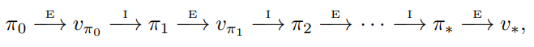

# Optimal Control

The objective of optimal control theory is to determine the control signals that will cause a process to satisfy the physical constraints and at the same time minimize (or maximize) some performance criterion.

## Linear Quadratic Regulator (LQR) Problem

The Linear Quadratic Regulator (LQR) is a well-known optimal control technique used to design controllers for linear systems with quadratic cost functions. The LQR problem aims to find the control input that minimizes a quadratic cost function, subject to the dynamics of a linear system.

### Problem Formulation

#### Continuous-Time System Dynamics

Consider a linear time-invariant (LTI) system described by the following state-space equations:

$$
\dot{x}(t) = A x(t) + B u(t)
$$

where:
- $x(t) \in \mathbb{R}^n$ is the state vector.
- $u(t) \in \mathbb{R}^m$ is the control input vector.
- $A \in \mathbb{R}^{n \times n}$ is the system matrix.
- $B \in \mathbb{R}^{n \times m}$ is the input matrix.

#### Continuous-Time Cost Function

The goal is to minimize the following quadratic cost function:

$$
J = \int_{0}^{\infty} \left( x(t)^T Q x(t) + u(t)^T R u(t) \right) dt
$$

where:
- $Q \in \mathbb{R}^{n \times n}$ is a positive semi-definite matrix that penalizes the state deviation.
- $R \in \mathbb{R}^{m \times m}$ is a positive definite matrix that penalizes the control effort.

### Solution Approach for Continuous-Time Systems

The solution to the LQR problem is typically obtained using the following steps:

#### 1. Derive the Optimal Control Law

The optimal control law is given by:

$$
u(t) = -K x(t)
$$

where $K \in \mathbb{R}^{m \times n}$ is the feedback gain matrix. The matrix $K$ is derived using the solution to the algebraic Riccati equation.

#### 2. Solve the Algebraic Riccati Equation (ARE)

The feedback gain matrix $K$ is obtained by solving the following algebraic Riccati equation:

$$
A^T P + P A - P B R^{-1} B^T P + Q = 0
$$

where $P \in \mathbb{R}^{n \times n}$ is a positive definite matrix. The solution $P$ to this equation is used to compute the feedback gain $K$ as follows:

$$
K = R^{-1} B^T P
$$

#### 3. Implement the Control Law

Once the feedback gain $K$ is computed, the optimal control law $u(t) = -K x(t)$ can be implemented in the system.

### Discrete-Time Systems

#### Discrete-Time System Dynamics

Consider a discrete-time linear time-invariant (LTI) system described by the following state-space equations:

$$
x[k+1] = A_d x[k] + B_d u[k]
$$

where:
- $x[k] \in \mathbb{R}^n$ is the state vector at time step $k$.
- $u[k] \in \mathbb{R}^m$ is the control input vector at time step $k$.
- $A_d \in \mathbb{R}^{n \times n}$ is the discrete-time system matrix.
- $B_d \in \mathbb{R}^{n \times m}$ is the discrete-time input matrix.

#### Discrete-Time Cost Function

The goal is to minimize the following quadratic cost function:

$$
J = \sum_{k=0}^{\infty} \left( x[k]^T Q_d x[k] + u[k]^T R_d u[k] \right)
$$

where:
- $Q_d \in \mathbb{R}^{n \times n}$ is a positive semi-definite matrix that penalizes the state deviation.
- $R_d \in \mathbb{R}^{m \times m}$ is a positive definite matrix that penalizes the control effort.

### Solution Approach for Discrete-Time Systems

The solution to the discrete-time LQR problem is typically obtained using the following steps:

#### 1. Derive the Optimal Control Law

The optimal control law is given by:

$$
u[k] = -K_d x[k]
$$

where $K_d \in \mathbb{R}^{m \times n}$ is the feedback gain matrix. The matrix $K_d$ is derived using the solution to the discrete-time algebraic Riccati equation.

#### 2. Solve the Discrete-Time Algebraic Riccati Equation (DARE)

The feedback gain matrix $K_d$ is obtained by solving the following discrete-time algebraic Riccati equation:

$$
A_d^T P_d A_d - P_d - A_d^T P_d B_d (B_d^T P_d B_d + R_d)^{-1} B_d^T P_d A_d + Q_d = 0
$$

where $P_d \in \mathbb{R}^{n \times n}$ is a positive definite matrix. The solution $P_d$ to this equation is used to compute the feedback gain $K_d$ as follows:

$$
K_d = (B_d^T P_d B_d + R_d)^{-1} B_d^T P_d A_d
$$

#### 3. Implement the Control Law

Once the feedback gain $K_d$ is computed, the optimal control law $u[k] = -K_d x[k]$ can be implemented in the discrete-time system.

### Analytical Solution to DARE

The Discrete-Time Algebraic Riccati Equation (DARE) can be solved analytically using the eigenvalue decomposition of the Hamiltonian matrix. The steps are as follows:

#### 1. Define the Hamiltonian Matrix

The Hamiltonian matrix $H$ is defined as:

$$
H = \begin{pmatrix}
A_d & -B_d (R_d + B_d^T P_d B_d)^{-1} B_d^T P_d A_d \\
-Q_d & A_d^T
\end{pmatrix}
$$

#### 2. Eigenvalue Decomposition

Perform an eigenvalue decomposition of the Hamiltonian matrix $H$:

$$
H = V \Lambda V^{-1}
$$

where:
- $\Lambda$ is a diagonal matrix containing the eigenvalues of $H$.
- $V$ is a matrix whose columns are the eigenvectors of $H$.

#### 3. Partition the Eigenvectors

Partition the matrix $V$ into four blocks:

$$
V = \begin{pmatrix}
V_{11} & V_{12} \\
V_{21} & V_{22}
\end{pmatrix}
$$

where:
- $V_{11} \in \mathbb{R}^{n \times n}$
- $V_{12} \in \mathbb{R}^{n \times n}$
- $V_{21} \in \mathbb{R}^{n \times n}$
- $V_{22} \in \mathbb{R}^{n \times n}$

#### 4. Compute the Solution $P_d$

The solution $P_d$ to the DARE is given by:

$$
P_d = V_{21} V_{11}^{-1}
$$

#### 5. Verify Positive Definiteness

Ensure that $P_d$ is positive definite by checking that all eigenvalues of $P_d$ are positive.

#### How to Compute SVD of a Matrix

The Singular Value Decomposition (SVD) is a fundamental matrix factorization technique that decomposes a matrix into three constituent matrices. SVD is widely used in various fields such as signal processing, statistics, and machine learning. Given a matrix $A \in \mathbb{R}^{m \times n}$, the SVD of $A$ is given by:

$$
A = U \Sigma V^T
$$

where:
- $U \in \mathbb{R}^{m \times m}$ is an orthogonal matrix whose columns are the left singular vectors of $A$.
- $\Sigma \in \mathbb{R}^{m \times n}$ is a diagonal matrix containing the singular values of $A$.
- $V \in \mathbb{R}^{n \times n}$ is an orthogonal matrix whose columns are the right singular vectors of $A$.

##### Steps to Compute the SVD

The SVD of a matrix $A$ can be computed using the following steps:

###### 1. Form the Matrix $A^T A$

Compute the matrix $A^T A$, where $A^T$ is the transpose of $A$:

$$
A^T A \in \mathbb{R}^{n \times n}
$$

###### 2. Compute the Eigenvalues and Eigenvectors of $A^T A$

Find the eigenvalues and eigenvectors of the matrix $A^T A$. Let $\lambda_1, \lambda_2, \dots, \lambda_n$ be the eigenvalues of $A^T A$, and let $v_1, v_2, \dots, v_n$ be the corresponding eigenvectors.

###### 3. Form the Matrix $V$

The matrix $V$ is formed by arranging the eigenvectors $v_1, v_2, \dots, v_n$ as columns:

$$
V = [v_1, v_2, \dots, v_n]
$$

###### 4. Compute the Singular Values

The singular values of $A$ are the square roots of the eigenvalues of $A^T A$:

$$
\sigma_i = \sqrt{\lambda_i} \quad \text{for} \quad i = 1, 2, \dots, n
$$

###### 5. Form the Diagonal Matrix $\Sigma$

The diagonal matrix $\Sigma$ is formed by placing the singular values $\sigma_1, \sigma_2, \dots, \sigma_n$ on its diagonal. If $m \geq n$, $\Sigma$ is an $m \times n$ matrix with the singular values on the diagonal:

$$
\Sigma = \begin{pmatrix}
\sigma_1 & 0 & \cdots & 0 \\
0 & \sigma_2 & \cdots & 0 \\
\vdots & \vdots & \ddots & \vdots \\
0 & 0 & \cdots & \sigma_n \\
0 & 0 & \cdots & 0 \\
\vdots & \vdots & \ddots & \vdots \\
0 & 0 & \cdots & 0
\end{pmatrix}
$$

If $m < n$, $\Sigma$ is an $m \times n$ matrix with the singular values on the diagonal:

$$
\Sigma = \begin{pmatrix}
\sigma_1 & 0 & \cdots & 0 \\
0 & \sigma_2 & \cdots & 0 \\
\vdots & \vdots & \ddots & \vdots \\
0 & 0 & \cdots & \sigma_m
\end{pmatrix}
$$

###### 6. Compute the Left Singular Vectors

The left singular vectors $u_i$ are computed as:

$$
u_i = \frac{1}{\sigma_i} A v_i \quad \text{for} \quad i = 1, 2, \dots, \min(m, n)
$$

If $m > n$, additional left singular vectors can be computed as the orthonormal basis of the null space of $A^T$.

###### 7. Form the Matrix $U$

The matrix $U$ is formed by arranging the left singular vectors $u_1, u_2, \dots, u_m$ as columns:

$$
U = [u_1, u_2, \dots, u_m]
$$

## Reinforcement Learning Application

### RL Fundamentals

#### Markov Decision Process (MDP)

The Markov decision process (MDP) is a mathematical framework used for modeling decision-making problems where the outcomes are partly random and partly controllable. It's a framework that can address most reinforcement learning (RL) problems.

#### Value Function $\mathcal{v}(s)$ - Bellman Equation

$$
\mathcal{v}^\pi(s) = E_\pi\{R_t|s_t=s\} = \sum_a [\pi(a|s) \sum_{s^\prime}p(s^\prime, r|s, a)[r + \gamma \mathcal{v}^\pi(s^\prime)]]
$$

#### Action-Value Function $Q(s, a)$

$$
q(s, a) = \sum_{s^\prime}p(s^\prime, r|s, a)[r + \gamma \mathcal{v}^\pi(s^\prime)]
$$

$$
\quad \quad \quad \quad \quad \quad \quad \quad \quad = \sum_{s^\prime}p(s^\prime, r|s, a)[r + \gamma \sum_{a^\prime} \pi(a^\prime|s^\prime)q(s^\prime, a^\prime)]
$$

**Note 1:** In control problems, we usually are looking for deterministic policies, and our environment is deterministic too. So in control problems we usually have:

$$
\mathcal{v}^\pi(s) = r + \gamma \mathcal{v}^\pi(s^\prime)
$$

$$
q(s, a) = r + \gamma q(s^\prime, a^\prime)
$$

#### Policy Evaluation (Prediction)

#### Policy Iteration

#### Generalized Policy Iteration

### Solving LQR Problem Using Dynamic Programming

**System Equation:**

$$
x_{k+1} = A_d x_k + B_d u_k
$$

To solve the Linear Quadratic Regulator (LQR) problem using Dynamic Programming (DP) and value iteration, one must iteratively compute the control gain matrix $K$ until convergence. The iterative update equations are given by:

$$
P_{t+1} = (A_d - BK_t)' P_t (A_d - BK_t) + Q + K_t' R K_t
$$

$$
K_{t+1} = (R + B_d' P_{t+1} B_d)^{-1} B_d' P_{t+1} A_d
$$

where:
- $P_{t+1}$ is the updated cost-to-go matrix at iteration $t+1$.
- $K_{t+1}$ is the updated control gain matrix at iteration $t+1$.
- $A_d$ and $B_d$ are the system dynamics matrices.
- $Q$ and $R$ are the state and control cost matrices, respectively.
- $P_t$ is the cost-to-go matrix at iteration $t$.
- $K_t$ is the control gain matrix at iteration $t$.

These equations are iterated until $K$ converges to a stable value. For an example, see [LQR-DP.py](./Examples/LQR-DP.py) file.

### Solving LQR Problem Using Q-Learning

In general form $q^*(x_k, u_k)$ is:

$$
q^*(x_k, u_k) = r + \gamma \argmax_{u_{k+1}}[q(x_{k+1}, u_{k+1})]
$$

In LQR problem, we can define $q(x_k, u_k)$ as:

$$
q(x_k, u_k) = -x_k^T Q x_k - u_k^T R u_k + x_{k+1}^T P x_{k+1}
$$

$$
= \begin{bmatrix}
x_k \\
u_k
\end{bmatrix}^T \begin{bmatrix}
-Q + B_d^T P A_d & B_d^T P A_d \\
A_d^T P B_d & -R + B_d^T P B_d
\end{bmatrix} \begin{bmatrix}
x_k \\
u_k
\end{bmatrix} = z_k^T H z_k
$$

So you can see the action-value function of a linear system can be written as a linear combination of states and inputs. By derivation of $q$ with respect to input $u$, we can compute the optimal steady-state state feedback gain $K$.

$$
q(x_k, u_k) = z_k^T H z_k = z_k^T \begin{bmatrix}
H_{xx} & H_{xu} \\
H_{ux} & H_{uu}
\end{bmatrix} z_k
$$

$$
\frac{\partial{q}}{\partial{u}} = H_{ux} x_k + H_{uu} u_k = 0
$$

$$
u_k = -H_{uu}^{-1} H_{ux} x_k
$$

**Note:** $H$ can be estimated using observed states and implemented inputs.