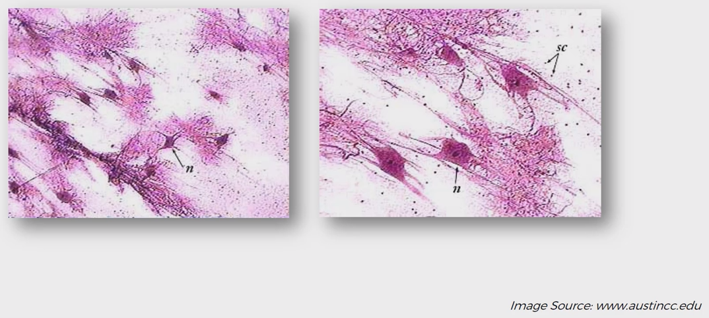
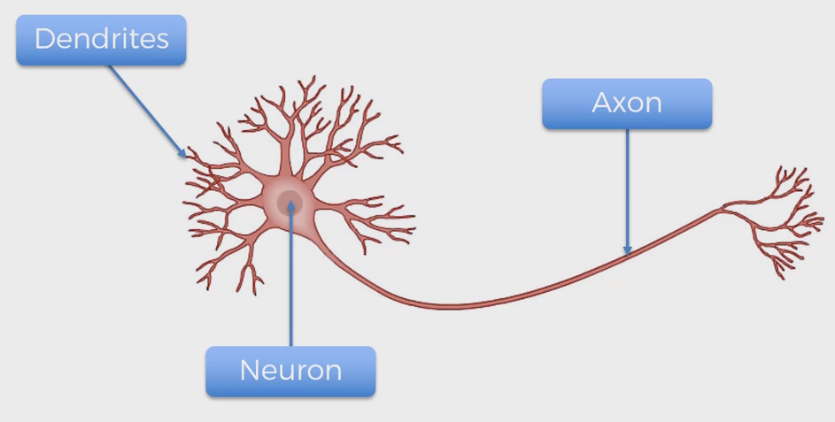
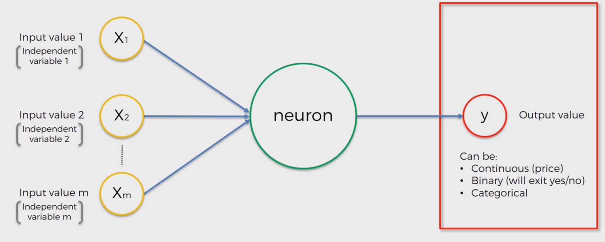
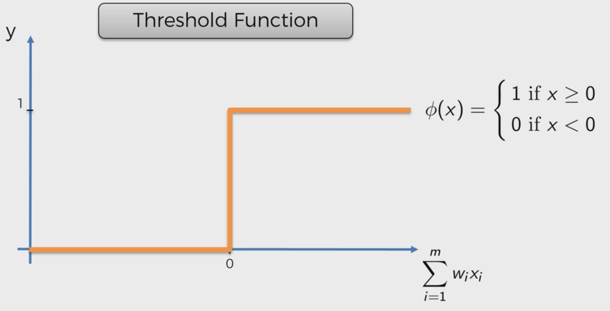
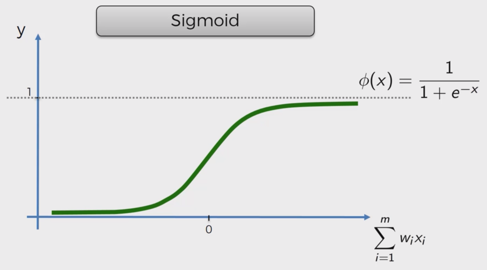
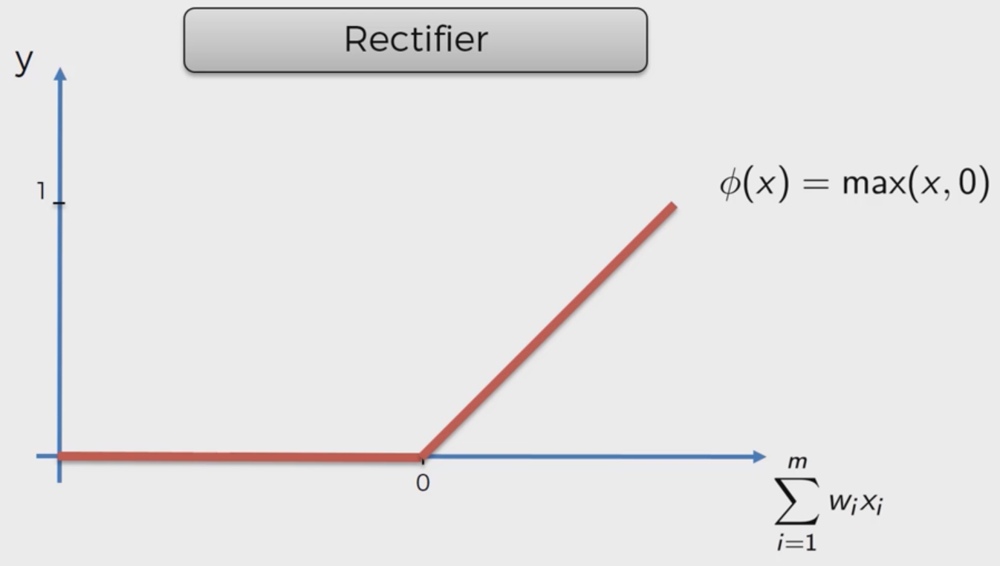
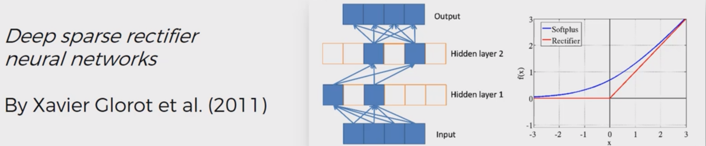

# ANN Introduction

## Artificial Neuron
Here is a picture of neurons :



And here is a schematic:



By mimicking this structure we hope we can create a learner as powerful as human brain. A neuron by itself doesn't do much, however by connecting them together in the right way they can do amazing things. Basically ANs are like this:



## Activation Functions

There are several common activation function in ANNs. Here are some of them : 

1. Threshold Function



2. Sigmoid



3. Rectifier




4. Hyperbolic Tangent


5. Softpluse
 


## How ANNs Learn

Artificial Neural Networks (ANNs) learn by adjusting their internal parameters to minimize the difference between their predictions and the actual outcomes. This process is known as **training**. Here's a concise explanation with diagrams:

### 1. **Data Input**
   - **Input Layer**: The network receives input data (e.g., images, text, numbers).
   - **Example**: If you're recognizing handwritten digits, each image (e.g., 28x28 pixels) is fed into the network.

   ```
   Input Layer: [Pixel 1, Pixel 2, ..., Pixel 784]
   ```

### 2. **Forward Pass**
   - **Hidden Layers**: The input data is passed through one or more hidden layers, where each neuron performs a weighted sum of its inputs and applies an activation function (e.g., ReLU, Sigmoid).
   - **Output Layer**: The final hidden layer passes its output to the output layer, which produces the network's prediction.

   ```
   Input Layer → Hidden Layer 1 → Hidden Layer 2 → Output Layer
   ```

### 3. **Loss Calculation**
   - **Loss Function**: The network's prediction is compared to the actual label using a loss function (e.g., Mean Squared Error, Cross-Entropy).
   - **Example**: If the network predicts "2" but the actual digit is "3", the loss function calculates the difference.

   ```
   Loss = Loss Function(Prediction, Actual Label)
   ```

   

### 4. **Backward Pass (Backpropagation)**
   - **Gradient Calculation**: The loss is used to calculate the gradient of the loss with respect to each parameter (weights and biases) in the network.
   - **Chain Rule**: Gradients are propagated backward through the network, layer by layer, using the chain rule of calculus.

   ```
   Output Layer ← Hidden Layer 2 ← Hidden Layer 1 ← Input Layer
   ```

### 5. **Parameter Update**
   - **Optimization**: The gradients guide the optimization algorithm (e.g., Gradient Descent, Adam) to update the network's parameters (weights and biases) in the direction that reduces the loss.
   - **Learning Rate**: The step size for updating parameters is controlled by the learning rate.

   ```
   New Weights = Old Weights - Learning Rate * Gradient
   ```

### 6. **Iterative Process**
   - **Training Loop**: The process of forward pass, loss calculation, backward pass, and parameter update is repeated for many iterations (epochs) until the network's predictions are sufficiently accurate.

   ```
   for epoch in epochs:
       for data in dataset:
           Forward Pass
           Loss Calculation
           Backward Pass
           Parameter Update
   ```

## Cost Functions for Training ANNs

Cost functions, also known as loss functions, measure the difference between the predicted output of a neural network and the actual target values. Different cost functions are used depending on the type of problem (e.g., regression, classification) and the specific requirements of the task. Below is a list of commonly used cost functions, their formulas, and their characteristics.

### 1. **Mean Squared Error (MSE)**
#### Formula:
$$\text{MSE} = \frac{1}{n} \sum_{i=1}^{n} (y_i - \hat{y}_i)^2$$

#### Characteristics:
- **Use Cases**: Regression problems where the output is a continuous value.
- **Benefits**: Simple to understand and implement.
- **Drawbacks**: Sensitive to outliers due to the squaring of errors.
- **Suitability**: Best for problems where all errors are equally important.

### 2. **Mean Absolute Error (MAE)**
#### Formula:
$$\text{MAE} = \frac{1}{n} \sum_{i=1}^{n} |y_i - \hat{y}_i|$$

#### Characteristics:
- **Use Cases**: Regression problems, especially when outliers are present.
- **Benefits**: Less sensitive to outliers compared to MSE.
- **Drawbacks**: The derivative is not defined at zero, which can complicate gradient-based optimization.
- **Suitability**: Good for robust regression tasks.

### 3. **Binary Cross-Entropy (Log Loss)**
#### Formula:
$$\text{Binary Cross-Entropy} = -\frac{1}{n} \sum_{i=1}^{n} [y_i \log(\hat{y}_i) + (1 - y_i) \log(1 - \hat{y}_i)]$$

#### Characteristics:
- **Use Cases**: Binary classification problems.
- **Benefits**: Encourages the model to output probabilities close to 0 or 1.
- **Drawbacks**: Can be numerically unstable when predictions are very close to 0 or 1.
- **Suitability**: Ideal for binary classification tasks.

### 4. **Categorical Cross-Entropy**
#### Formula:
$$\text{Categorical Cross-Entropy} = -\frac{1}{n} \sum_{i=1}^{n} \sum_{j=1}^{C} y_{ij} \log(\hat{y}_{ij})$$

#### Characteristics:
- **Use Cases**: Multi-class classification problems.
- **Benefits**: Encourages the model to output probabilities close to the true class distribution.
- **Drawbacks**: Requires the target labels to be one-hot encoded.
- **Suitability**: Best for multi-class classification tasks.

### 5. **Hinge Loss (SVM Loss)**
#### Formula:
$$\text{Hinge Loss} = \frac{1}{n} \sum_{i=1}^{n} \max(0, 1 - y_i \cdot \hat{y}_i)$$

#### Characteristics:
- **Use Cases**: Support Vector Machines (SVMs) and binary classification problems.
- **Benefits**: Encourages a large margin between classes.
- **Drawbacks**: Not differentiable at certain points, which can complicate optimization.
- **Suitability**: Good for problems where a large margin is desired.

### 6. **Kullback-Leibler Divergence (KL Divergence)**
#### Formula:
$$\text{KL Divergence} = \sum_{i=1}^{n} y_i \log\left(\frac{y_i}{\hat{y}_i}\right)$$

#### Characteristics:
- **Use Cases**: Probability distribution comparison, especially in variational autoencoders.
- **Benefits**: Measures the difference between two probability distributions.
- **Drawbacks**: Not symmetric and not a true metric.
- **Suitability**: Useful in generative models and information theory.

### 7. **Huber Loss**
#### Formula:
$$\text{Huber Loss} = \begin{cases} 
\frac{1}{2}(y_i - \hat{y}_i)^2 & \text{for } |y_i - \hat{y}_i| \leq \delta \\
\delta |y_i - \hat{y}_i| - \frac{1}{2}\delta^2 & \text{otherwise}
\end{cases}$$

#### Characteristics:
- **Use Cases**: Regression problems, especially when outliers are present.
- **Benefits**: Combines the benefits of MSE (quadratic for small errors) and MAE (linear for large errors).
- **Drawbacks**: Requires tuning of the hyperparameter $\delta$.
- **Suitability**: Good for robust regression tasks with outliers.

### 8. **Poisson Loss**
#### Formula:
$$\text{Poisson Loss} = \frac{1}{n} \sum_{i=1}^{n} (\hat{y}_i - y_i \log(\hat{y}_i))$$

#### Characteristics:
- **Use Cases**: Regression problems where the target variable represents counts (e.g., number of events).
- **Benefits**: Appropriate for count data, as it assumes the target follows a Poisson distribution.
- **Drawbacks**: Requires the target to be non-negative.
- **Suitability**: Ideal for count-based regression tasks.

### 9. **Cosine Proximity**
#### Formula:
$$\text{Cosine Proximity} = -\frac{\sum_{i=1}^{n} y_i \cdot \hat{y}_i}{\sqrt{\sum_{i=1}^{n} y_i^2} \cdot \sqrt{\sum_{i=1}^{n} \hat{y}_i^2}}$$

#### Characteristics:
- **Use Cases**: Problems where the direction of the prediction vector is more important than the magnitude.
- **Benefits**: Focuses on the angle between the true and predicted vectors.
- **Drawbacks**: Ignores the magnitude of the predictions.
- **Suitability**: Useful in tasks like word embeddings and recommendation systems.

### 10. **Triplet Loss**
#### Formula:
$$\text{Triplet Loss} = \max(0, d(a, p) - d(a, n) + \alpha)$$

#### Characteristics:
- **Use Cases**: Metric learning, face recognition, and other tasks requiring embedding similarity.
- **Benefits**: Encourages the model to learn embeddings where similar items are closer together.
- **Drawbacks**: Requires careful selection of triplets (anchor, positive, negative).
- **Suitability**: Ideal for tasks requiring embedding similarity.

## Gradient Descent (GD) and Stochastic Gradient Descent (SGD)

Gradient Descent (GD) and Stochastic Gradient Descent (SGD) are optimization algorithms used to minimize the loss function in training machine learning models, particularly neural networks. Here's a brief tutorial on both methods:

### 1. **Gradient Descent (GD)**

#### Overview
Gradient Descent is an iterative optimization algorithm used to find the minimum of a function. In the context of machine learning, it is used to minimize the loss function by adjusting the model parameters.

#### Steps
1. **Initialize Parameters**: Start with an initial guess for the model parameters (weights and biases).
2. **Compute Gradient**: Calculate the gradient of the loss function with respect to each parameter.
3. **Update Parameters**: Adjust the parameters in the direction opposite to the gradient to reduce the loss.
4. **Repeat**: Iterate steps 2 and 3 until convergence.

#### Formula
$$\theta_{t+1} = \theta_t - \eta \nabla J(\theta_t)$$

- $\theta_{t+1}$: Updated parameters.
- $\theta_t$: Current parameters.
- $\eta$: Learning rate (step size).
- $\nabla J(\theta_t)$: Gradient of the loss function $J$ with respect to the parameters $\theta_t$.

#### Characteristics
- **Batch Processing**: Uses the entire dataset to compute the gradient in each iteration.
- **Convergence**: Can converge to a global minimum if the loss function is convex.
- **Computational Cost**: High computational cost due to the need to compute the gradient over the entire dataset.

### 2. **Stochastic Gradient Descent (SGD)**

#### Overview
Stochastic Gradient Descent is a variant of Gradient Descent where the gradient is computed using a single randomly chosen data point (or a small subset called a mini-batch) in each iteration.

#### Steps
1. **Initialize Parameters**: Start with an initial guess for the model parameters.
2. **Randomly Select Data Point**: Choose a single data point (or a mini-batch) randomly.
3. **Compute Gradient**: Calculate the gradient of the loss function with respect to the selected data point.
4. **Update Parameters**: Adjust the parameters in the direction opposite to the gradient.
5. **Repeat**: Iterate steps 2-4 until convergence.

#### Formula
$$\theta_{t+1} = \theta_t - \eta \nabla J(\theta_t; x_i, y_i)$$

- $\theta_{t+1}$: Updated parameters.
- $\theta_t$: Current parameters.
- $\eta$: Learning rate.
- $\nabla J(\theta_t; x_i, y_i)$: Gradient of the loss function $J$ with respect to the parameters $\theta_t$ for a single data point $(x_i, y_i)$.

#### Characteristics
- **Stochastic Nature**: Uses a single data point or a mini-batch, making it stochastic.
- **Convergence**: Can oscillate around the minimum and may not converge to the exact minimum but often finds a good approximation.
- **Computational Cost**: Lower computational cost per iteration compared to GD.
- **Noise**: Introduces noise in the gradient, which can help escape local minima but may also cause instability.

[Next Topic >>](./1.ANN.md)