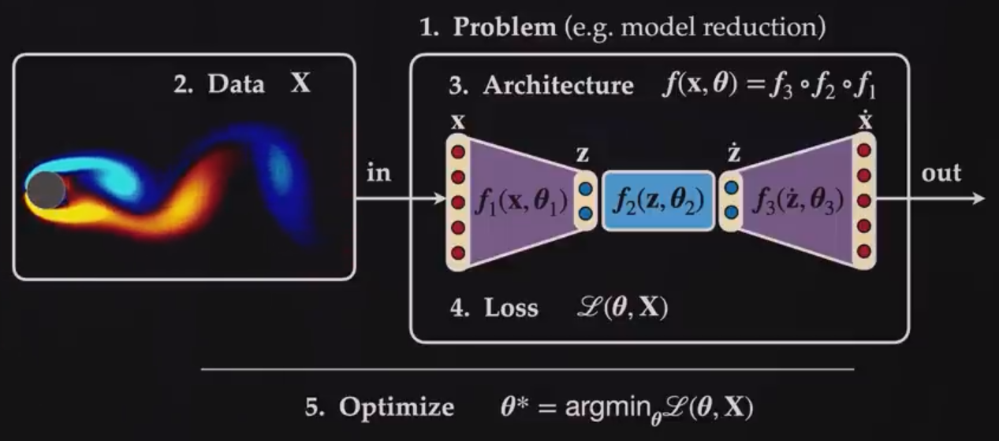
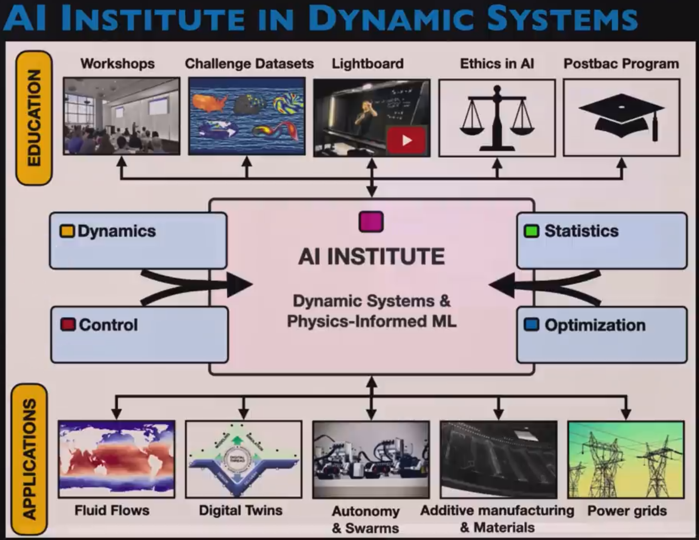

# Physics Informed Machine Learning
Physics-Informed Machine Learning is the intersection of ML and physics. It gives you the power to leverage your ML algorithms/systems using knowledge of physics, and it is also about modeling the physics that has not yet been written by humans. It's a powerful tool for a control and dynamic engineer for solving complex real world problems.

So There are two main approaches:
1. Enforce physics into ML : Less training effort and better generalization
2. Using ML to discover physics

### Workflow
1. Decide on problem. (What are we modeling?)
2. Curate data. (What data will inform the model?)
3. Design an architecture. (RNN, AutoEncoder, DMD, SINDy?)
4. Craft a loss function.
5. Optimization. (ADAM, SGD, ...)

**Note :** For this purpose, there is an Institute called **AI Institute in Dynamic Systems**.

 

There are three key aspects of physics that we usually enforce to our model:
1. Symmetry properties
2. Invariance
3. Conservation of energy 

## Choosing What to Model

## Curating Training Data

## Designing an Architecture

## Crafting a Loss Function

## Employing an Optimization Algorithm

## References
* [Steve Brunton - Physics Informed Machine Learning](https://www.youtube.com/playlist?list=PLMrJAkhIeNNQ0BaKuBKY43k4xMo6NSbBa)