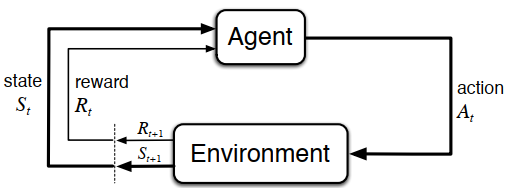

# Fundamentals of Reinforcement Learning

- [Fundamentals of Reinforcement Learning](#fundamentals-of-reinforcement-learning)
  - [Introduction](#introduction)
    - [Reinforcement Learning](#reinforcement-learning)
    - [Elements of Reinforcement Learning](#elements-of-reinforcement-learning)
  - [Core Ideas Of Reinforcement Learning Algorithms](#core-ideas-of-reinforcement-learning-algorithms)
    - [Markov Decision Process](#markov-decision-process)
    - [Goals and Rewards](#goals-and-rewards)
    - [Returns and Episodes](#returns-and-episodes)
    - [Policies and Value Functions](#policies-and-value-functions)
    - [Optimal Policies and Optimal Value Functions](#optimal-policies-and-optimal-value-functions)
  - [Dynamic Programming](#dynamic-programming)
    - [Policy Evaluation (Prediction)](#policy-evaluation-prediction)
  - [References](#references)

## Introduction
The idea that we learn by interacting with our environment is probably the first to occur to us when we think about the nature of learning. When an infant plays, waves its arms, or looks about, it has no explicit teacher, but it does have a direct sensorimotor connection to its environment. Exercising this connection produces a wealth of information about cause and effect, about the consequences of actions, and about what to do in order to achieve goals. Throughout our lives, such interactions are undoubtedly a major source of knowledge about our environment and ourselves. Whether we are learning to drive a car or to hold a  onversation, we are acutely aware of how our environment responds to what we do, and we seek to influence what happens through our behavior. Learning from interaction is a foundational idea underlying nearly all theories of learning and intelligence.

The approach we explore here, called reinforcement learning, is much more focused on goal-directed learning from interaction than are other  approaches to machine learning.

### Reinforcement Learning
**Reinforcement learning is learning what to do—how to map situations to actions—so as to maximize a numerical reward signal.** 

### Elements of Reinforcement Learning
1. **Agent**
2. **Environment**
3. **Policy** : Roughly speaking, a policy is a mapping from perceived states of the environment to actions to be taken when in those states. In some cases the policy may be a simple function or lookup table, whereas in others it may involve extensive computation such as a search process. In general, policies may be stochastic, specifying probabilities for each action.
4. **Reward signal** : The agent’s sole objective is to maximize the total reward it receives over the long run. The reward signal thus defines what are the good and bad events for the agent. In a biological system, we might think of rewards as analogous to the experiences of pleasure or pain. They are the immediate and defining features of the problem faced by the agent. The reward signal is the primary basis for altering the policy; if an action selected by the policy is followed by low reward, then the policy may be changed to select some other action in that situation in the future. In general, reward signals may be stochastic functions of the state of the environment and the actions taken.
5. **Value function** : Roughly speaking, the value of a state is the total amount of reward an agent can expect to accumulate over the future, starting from that state. Whereas rewards determine the immediate, intrinsic desirability of environmental states, values indicate the long-term desirability of states after taking into account the states that are likely to follow and the rewards available in those states.In fact, the most important component of almost all reinforcement learning algorithms we consider is a method for efficiently estimating values.
6. **Model of the environment (optional)**

## Core Ideas Of Reinforcement Learning Algorithms
### Markov Decision Process
MDPs are a mathematically idealized form of the reinforcement learning problem for which precise theoretical statements can be made. 

The function $p$ defines the dynamic of the MDP:

$$
p(s', r | s, a) = Pr[S_{t+1} = s', R_{t+1} = r | S_{t} = s, A_{t} = a]
$$

$S \text{: States}$

$R \text{: Reward}$

$A \text{: Action}$

From the four-argument dynamics function, p, one can compute anything else one might want to know about the environment, such as the *state-transition probabilities*,

$$
p(s'| s, r) = \sum_{r} p(s', r | s, a)
$$

$$
r(s, a) = E[R_t|S_{t} = s, A_{t} = a] = \sum_{r} r \sum_{s'} p(s', r | s, a)
$$

$$
r(s', a, s) = E[R_t|S_{t+1} = s', S_{t} = s, A_{t} = a] = \sum_{r} r \space \frac{p(s', r | s, a)}{p(s'| s, r)}
$$

### Goals and Rewards
In reinforcement learning, the purpose or goal of the agent is formalized in terms of a special signal, called the reward, passing from the environment to the agent. Informally, the agent’s goal is to maximize the total amount of reward it receives. This means maximizing not immediate reward, but cumulative reward in the long run. We can clearly state this informal idea as the reward hypothesis:

**That all of what we mean by goals and purposes can be well thought of as
the maximization of the expected value of the cumulative sum of a received
scalar signal (called reward).**

The reward signal is your way of communicating to the robot what you want it to achieve, not how you want it achieved.

### Returns and Episodes
In general, we seek to maximize the expected return, where the return, denoted $G_t$, is defined as some specific function of the reward sequence.

$$
G_t = \sum_{k=1}^{T} \gamma^{k-1} R_{t+k} = R_{t+1} + \gamma G_{t+1}
$$

$T \text{: Final time step}$

$\gamma \text{: Discount rate, } \space \space \space \space 0\le \gamma\le 1$

Each episode ends in a special
state called the terminal state, followed by a reset to a standard starting state or to a
sample from a standard distribution of starting states. Even if you think of episodes as ending in di↵erent ways, such as winning and losing a game, the next episode begins independently of how the previous one ended. Thus the episodes can all be considered to end in the same terminal state, with di↵erent rewards for the di↵erent outcomes. Tasks with episodes of this kind are called episodic tasks.

On the other hand, in many cases the agent–environment interaction does not break naturally into identifiable episodes, but goes on continually without limit. For example, this would be the natural way to formulate an on-going process-control task, or an application to a robot with a long life span. We call these continuing tasks.

### Policies and Value Functions
Almost all reinforcement learning algorithms involve estimating value functions—functions of states (or of state–action pairs) that estimate how good it is for the agent to be in a given state (or how good it is to perform a given action in a given state). The notion of “how good” here is defined in terms of future rewards that can be expected, or, to be precise, in terms of expected return. Of course the rewards the agent can expect to receive in the future depend on what actions it will take. Accordingly, value functions are defined with respect to particular ways of acting, called policies.

Formally, a policy is a mapping from states to probabilities of selecting each possible action. If the agent is following policy $\pi$ at time t, then $\pi(a|s)$ is the probability that $A_t = a$ if $S_t = s$.

The value function of a state $s$ under a policy $\pi$, denoted $v_\pi(s)$, is the expected return
when starting in s and following $\pi$ thereafter. For MDPs, we can define $v_\pi$ formally by

$$
v_\pi(s) = E[G_t|S_t = s] 
$$

$$
\implies v_\pi(s) = E[\sum_{k=1}^{T} \gamma^{k-1} R_{t+k}|S_t = s] 
$$

$$
\implies \boxed{v_\pi(s) = \sum_{a} \pi(a|s) \sum_{s', r} p(s', r | s, a)(r + \gamma v_{\pi}(s'))}
$$

Similarly, we define the value of taking action a in state s under a policy $\pi$, denoted $q_\pi(s, a)$ ( action-value function), as the expected return starting from s, taking the action a, and thereafter
following policy $\pi$:

$$
q_\pi(s, a) = E[G_t|S_t = s, A_t = a] 
$$

$$
\implies q_\pi(s, a) = E[\sum_{k=1}^{T} \gamma^{k-1} R_{t+k}|S_t = s, A_t = a] 
$$

$$
\implies \boxed{q_\pi(s, a) = \sum_{s', r} p(s', r | s, a)(r + \gamma v_{\pi}(s'))}
$$

### Optimal Policies and Optimal Value Functions
A policy $\pi$ is defined to be better than or equal to a policy $\pi'$ if its expected return is greater than or equal to that of $\pi'$ for all states. In other words, $\pi$ > $\pi'$ if and only if $v_\pi$(s) > $v_{\pi'}$(s) for all $s \in S$. There is always at least one policy that is better than or equal to all other policies. This is an optimal policy. Although there may be more than one, we denote all the optimal policies by $\pi*$. They share the same state-value function, called the optimal state-value function, denoted $v_*$, and defined as

$$
v_{*}(s) = \max_{\pi} v_{\pi}(s) 
$$

$$
\implies v_{\*}(s) = \max_{a} \sum_{s', r} p(s', r \mid s, a)(r + \gamma v_{\*}(s'))
$$

Optimal policies also share the same optimal action-value function,

$$
q_{*}(s,a) = \max_{\pi} q_{\pi}(s,a) 
$$

$$
\implies q_{\*}(s,a) = \sum_{s', r} p(s', r \mid s, a)(r + \gamma \max_{a'}q_{\*}(s', a'))
$$

## Dynamic Programming
The term dynamic programming (DP) refers to a collection of algorithms that can be used to compute optimal policies given a perfect model of the environment as a Markov decision process (MDP). Classical DP algorithms are of limited utility in reinforcement learning both because of their assumption of a perfect model and because of their great computational expense, but they are still important theoretically. DP provides an essential foundation for the understanding of the methods presented in RL. In fact, all of these methods can be viewed as attempts to achieve much the same e↵ect as DP, only with less computation and without assuming a perfect model of the environment.

The key idea of DP, and of reinforcement learning generally, is the use of value functions to organize and structure the search for good policies. We can easily obtain optimal policies once we have found the optimal value functions, $v_*$ or $q_*$, which satisfy the Bellman optimality equations.

### Policy Evaluation (Prediction)

First we consider how to compute the state-value function $v_\pi$ for an arbitrary policy $\pi$. This is called policy evaluation in the DP literature. We also refer to it as the prediction problem.

If the environment’s dynamics are completely known, then problem becomes a system of $|S|$ simultaneous linear equations in $|S|$ unknowns (the $v_\pi(s)$, $s \in S$). In principle, its solution is a straightforward, if tedious, computation.

## References
1. (book) Reinforcement Learning: An Introduction [Sutton & Burto]
