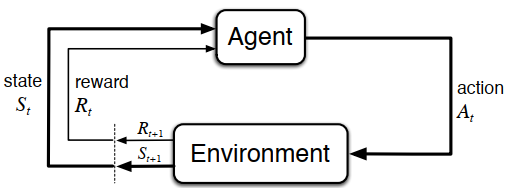

# Fundamentals of Reinforcement Learning

- [[#Introduction|Introduction]]
	- [[#Introduction#Reinforcement Learning|Reinforcement Learning]]
	- [[#Introduction#Elements of Reinforcement Learning|Elements of Reinforcement Learning]]
	- [[#Introduction#A Map For Basic RL Algorithms|A Map For Basic RL Algorithms]]
- [[#Multi-armed Bandits (A review on RL concepts)|Multi-armed Bandits (A review on RL concepts)]]
	- [[#Multi-armed Bandits (A review on RL concepts)#Some basic solution to exploration-exploitation dillema|Some basic solution to exploration-exploitation dillema]]
- [[#How to do Real World RL|How to do Real World RL]]
	- [[#How to do Real World RL#Priorities|Priorities]]
- [[#Core Ideas Of Reinforcement Learning Algorithms|Core Ideas Of Reinforcement Learning Algorithms]]
	- [[#Core Ideas Of Reinforcement Learning Algorithms#Markov Decision Process|Markov Decision Process]]
	- [[#Core Ideas Of Reinforcement Learning Algorithms#Goals and Rewards|Goals and Rewards]]
	- [[#Core Ideas Of Reinforcement Learning Algorithms#Returns and Episodes|Returns and Episodes]]
	- [[#Core Ideas Of Reinforcement Learning Algorithms#Policies and Value Functions|Policies and Value Functions]]
	- [[#Core Ideas Of Reinforcement Learning Algorithms#Optimal Policies and Optimal Value Functions|Optimal Policies and Optimal Value Functions]]
- [[#Dynamic Programming|Dynamic Programming]]
	- [[#Dynamic Programming#Policy Evaluation (Prediction)|Policy Evaluation (Prediction)]]
	- [[#Dynamic Programming#Policy Improvement|Policy Improvement]]
	- [[#Dynamic Programming#Policy Iteration|Policy Iteration]]
	- [[#Dynamic Programming#Generalized Policy Iteration|Generalized Policy Iteration]]
	- [[#Dynamic Programming#Efficiency of Dynamic Programming|Efficiency of Dynamic Programming]]
- [[#Monte Carlo Methods|Monte Carlo Methods]]
	- [[#Monte Carlo Methods#Monte Carlo Prediction|Monte Carlo Prediction]]
	- [[#Monte Carlo Methods#Monte Carlo Estimation of Action Values|Monte Carlo Estimation of Action Values]]
	- [[#Monte Carlo Methods#Monte Carlo Control|Monte Carlo Control]]
	- [[#Monte Carlo Methods#Monte Carlo Control without Exploring Starts|Monte Carlo Control without Exploring Starts]]
		- [[#Monte Carlo Control without Exploring Starts#On-Policy MC Control|On-Policy MC Control]]
		- [[#Monte Carlo Control without Exploring Starts#Off-Policy MC Control via Importance Sampling|Off-Policy MC Control via Importance Sampling]]
- [[#Temporal-Difference Learning|Temporal-Difference Learning]]
	- [[#Temporal-Difference Learning#TD Prediction|TD Prediction]]
	- [[#Temporal-Difference Learning#Advantages of TD Prediction Methods|Advantages of TD Prediction Methods]]
	- [[#Temporal-Difference Learning#Sarsa: On-policy TD Control|Sarsa: On-policy TD Control]]
	- [[#Temporal-Difference Learning#Q-learning: Off-policy TD Control|Q-learning: Off-policy TD Control]]
	- [[#Temporal-Difference Learning#Expected Sarsa|Expected Sarsa]]
	- [[#Temporal-Difference Learning#Maximization Bias and Double Learning|Maximization Bias and Double Learning]]
	- [[#Temporal-Difference Learning#Open challenges|Open challenges]]
- [[#$n$-step Bootstrapping|$n$-step Bootstrapping]]
- [[#Planning and Learning with Tabular Methods|Planning and Learning with Tabular Methods]]
	- [[#Planning and Learning with Tabular Methods#Models and Planning|Models and Planning]]
	- [[#Planning and Learning with Tabular Methods#Dyna: Integrated Planning, Acting, and Learning|Dyna: Integrated Planning, Acting, and Learning]]
	- [[#Planning and Learning with Tabular Methods#When the Model Is Wrong|When the Model Is Wrong]]
	- [[#Planning and Learning with Tabular Methods#Prioritized Sweeping|Prioritized Sweeping]]
	- [[#Planning and Learning with Tabular Methods#A few references for Control+RL|A few references for Control+RL]]
- [[#On-policy Prediction with Approximation|On-policy Prediction with Approximation]]
	- [[#On-policy Prediction with Approximation#The Prediction Objective ($\bar{VE}$)|The Prediction Objective ($\bar{VE}$)]]
	- [[#On-policy Prediction with Approximation#Stochastic-gradient and Semi-gradient Methods|Stochastic-gradient and Semi-gradient Methods]]
	- [[#On-policy Prediction with Approximation#Linear Methods|Linear Methods]]
	- [[#On-policy Prediction with Approximation#Feature Construction for Linear Methods|Feature Construction for Linear Methods]]
		- [[#Feature Construction for Linear Methods#Polynomials|Polynomials]]
		- [[#Feature Construction for Linear Methods#Fourier Basis|Fourier Basis]]
		- [[#Feature Construction for Linear Methods#Coarse Coding|Coarse Coding]]
		- [[#Feature Construction for Linear Methods#Tile Coding|Tile Coding]]
		- [[#Feature Construction for Linear Methods#Radial Basis Functions|Radial Basis Functions]]
	- [[#On-policy Prediction with Approximation#Selecting Step-Size Parameters Manually|Selecting Step-Size Parameters Manually]]
	- [[#On-policy Prediction with Approximation#Nonlinear Function Approximation: Artificial Neural Networks|Nonlinear Function Approximation: Artificial Neural Networks]]
	- [[#On-policy Prediction with Approximation#F.A Challenges|F.A Challenges]]
- [[#On-policy Control with Approximation|On-policy Control with Approximation]]
- [[#References|References]]


## Introduction
The idea that we learn by interacting with our environment is probably the first to occur to us when we think about the nature of learning. When an infant plays, waves its arms, or looks about, it has no explicit teacher, but it does have a direct sensorimotor connection to its environment. Exercising this connection produces a wealth of information about cause and effect, about the consequences of actions, and about what to do in order to achieve goals. Throughout our lives, such interactions are undoubtedly a major source of knowledge about our environment and ourselves. Whether we are learning to drive a car or to hold a  onversation, we are acutely aware of how our environment responds to what we do, and we seek to influence what happens through our behavior. Learning from interaction is a foundational idea underlying nearly all theories of learning and intelligence.

The approach we explore here, called reinforcement learning, is much more focused on goal-directed learning from interaction than are other  approaches to machine learning.

### Reinforcement Learning
**Reinforcement learning is learning what to do—how to map situations to actions—so as to maximize a numerical reward signal.** 

### Elements of Reinforcement Learning
1. **Agent**
2. **Environment**
3. **Policy** : Roughly speaking, a policy is a mapping from perceived states of the environment to actions to be taken when in those states. In some cases the policy may be a simple function or lookup table, whereas in others it may involve extensive computation such as a search process. In general, policies may be stochastic, specifying probabilities for each action.
4. **Reward signal** : The agent’s sole objective is to maximize the total reward it receives over the long run. The reward signal thus defines what are the good and bad events for the agent. In a biological system, we might think of rewards as analogous to the experiences of pleasure or pain. They are the immediate and defining features of the problem faced by the agent. The reward signal is the primary basis for altering the policy; if an action selected by the policy is followed by low reward, then the policy may be changed to select some other action in that situation in the future. In general, reward signals may be stochastic functions of the state of the environment and the actions taken.
5. **Value function** : Roughly speaking, the value of a state is the total amount of reward an agent can expect to accumulate over the future, starting from that state. Whereas rewards determine the immediate, intrinsic desirability of environmental states, values indicate the long-term desirability of states after taking into account the states that are likely to follow and the rewards available in those states.In fact, the most important component of almost all reinforcement learning algorithms we consider is a method for efficiently estimating values.
6. **Model of the environment (optional)**

### A Map For Basic RL Algorithms


## Multi-armed Bandits (A review on RL concepts)
Consider the following learning problem. You are faced repeatedly with a choice among k different options, or actions. After each choice you receive a numerical reward chosen from a stationary probability distribution that depends on the action you selected. Your objective is to maximize the expected total reward over some time period, for example, over 1000 action selections, or *time steps*. 

our k-armed bandit problem, each of the k actions has an **expected or mean reward** given that that action is selected; let us call this the value of that action. If you knew the value of each action, then it would be trivial to solve the k-armed bandit problem: you would always select the action with highest value. If you maintain estimates of the action values, then at any time step there is at least one action whose estimated value is greatest. We call these the greedy actions. When you select one of these actions, we say that you are **exploiting** your current knowledge of the values of the actions. If instead you select one of the non-greedy actions, then we say you are **exploring**, because this enables you to improve your estimate of the non-greedy action’s value.

For more informations on this subject, you can refer to RL:An introduction book by Sutton an Burto.

### Some basic solution to exploration-exploitation dillema
1. $\epsilon-greedy$ method
	1. Choose the best action with 1-$\epsilon$ probability
	2. Choose a random action with $\epsilon$ probability
2. Optimistic initial values
	1. Initialise the action-values or state values high enough to make sure the agent is going to try them all enough at the beginning 
3. Upper confidence boundary (UCB)

## How to do Real World RL
The answer is, by shifting the learning process’ priorities. 
### Priorities 
• Generalisation over temporal credit assignments
• Considering that the environment controls not the agent
• Statistical efficiency over computational efficiency
• You need to thinks about features not the states
• Evaluation over Learning
• Every policy you are implementing in the real world is important but in the simulator only the last policy is important

## Core Ideas Of Reinforcement Learning Algorithms
### Markov Decision Process
MDPs are a mathematically idealized form of the reinforcement learning problem for which precise theoretical statements can be made. 


The function $p$ defines the dynamic of the MDP:

$$
p(s', r | s, a) = Pr[S_{t+1} = s', R_{t+1} = r | S_{t} = s, A_{t} = a]
$$

$S \text{: States}$

$R \text{: Reward}$

$A \text{: Action}$

From the four-argument dynamics function, p, one can compute anything else one might want to know about the environment, such as the *state-transition probabilities*,

$$
p(s'| s, r) = \sum_{r} p(s', r | s, a)
$$

$$
r(s, a) = E[R_t|S_{t} = s, A_{t} = a] = \sum_{r} r \sum_{s'} p(s', r | s, a)
$$

$$
r(s', a, s) = E[R_t|S_{t+1} = s', S_{t} = s, A_{t} = a] = \sum_{r} r \space \frac{p(s', r | s, a)}{p(s'| s, r)}
$$

### Goals and Rewards
In reinforcement learning, the purpose or goal of the agent is formalized in terms of a special signal, called the reward, passing from the environment to the agent. Informally, the agent’s goal is to maximize the total amount of reward it receives. This means maximizing not immediate reward, but cumulative reward in the long run. We can clearly state this informal idea as the reward hypothesis:

**That all of what we mean by goals and purposes can be well thought of as
the maximization of the expected value of the cumulative sum of a received
scalar signal (called reward).**

The reward signal is your way of communicating to the robot what you want it to achieve, not how you want it achieved.

### Returns and Episodes
In general, we seek to maximize the expected return, where the return, denoted $G_t$, is defined as some specific function of the reward sequence.

$$
G_t = \sum_{k=1}^{T} \gamma^{k-1} R_{t+k} = R_{t+1} + \gamma G_{t+1}
$$

$T \text{: Final time step}$

$\gamma \text{: Discount rate, } \space \space \space \space 0\le \gamma\le 1$

Each episode ends in a special
state called the terminal state, followed by a reset to a standard starting state or to a
sample from a standard distribution of starting states. Even if you think of episodes as ending in differerent ways, such as winning and losing a game, the next episode begins independently of how the previous one ended. Thus the episodes can all be considered to end in the same terminal state, with differerent rewards for the differerent outcomes. Tasks with episodes of this kind are called episodic tasks.

On the other hand, in many cases the agent–environment interaction does not break naturally into identifiable episodes, but goes on continually without limit. For example, this would be the natural way to formulate an on-going process-control task, or an application to a robot with a long life span. We call these continuing tasks.

### Policies and Value Functions
Almost all reinforcement learning algorithms involve estimating value functions—functions of states (or of state–action pairs) that estimate how good it is for the agent to be in a given state (or how good it is to perform a given action in a given state). The notion of “how good” here is defined in terms of future rewards that can be expected, or, to be precise, in terms of expected return. Of course the rewards the agent can expect to receive in the future depend on what actions it will take. Accordingly, value functions are defined with respect to particular ways of acting, called policies.

Formally, a policy is a mapping from states to probabilities of selecting each possible action. If the agent is following policy $\pi$ at time t, then $\pi(a|s)$ is the probability that $A_t = a$ if $S_t = s$.

The value function of a state $s$ under a policy $\pi$, denoted $v_\pi(s)$, is the expected return
when starting in s and following $\pi$ thereafter. For MDPs, we can define $v_\pi$ formally by

$$
v_\pi(s) = E[G_t|S_t = s] 
$$

$$
\implies v_\pi(s) = E[\sum_{k=1}^{T} \gamma^{k-1} R_{t+k}|S_t = s] 
$$

$$
\implies \boxed{v_\pi(s) = \sum_{a} \pi(a|s) \sum_{s', r} p(s', r | s, a)(r + \gamma v_{\pi}(s'))}
$$

Similarly, we define the value of taking action a in state s under a policy $\pi$, denoted $q_\pi(s, a)$ ( action-value function), as the expected return starting from s, taking the action a, and thereafter
following policy $\pi$:

$$
q_\pi(s, a) = E[G_t|S_t = s, A_t = a] 
$$

$$
\implies q_\pi(s, a) = E[\sum_{k=1}^{T} \gamma^{k-1} R_{t+k}|S_t = s, A_t = a] 
$$

$$
\implies \boxed{q_\pi(s, a) = \sum_{s', r} p(s', r | s, a)(r + \gamma v_{\pi}(s'))}
$$

### Optimal Policies and Optimal Value Functions
A policy $\pi$ is defined to be better than or equal to a policy $\pi'$ if its expected return is greater than or equal to that of $\pi'$ for all states. In other words, $\pi$ > $\pi'$ if and only if $v_\pi$(s) > $v_{\pi'}$(s) for all $s \in S$. There is always at least one policy that is better than or equal to all other policies. This is an optimal policy. Although there may be more than one, we denote all the optimal policies by $\pi*$. They share the same state-value function, called the optimal state-value function, denoted $v_*$, and defined as

$$
v_{*}(s) = \max_{\pi} v_{\pi}(s) 
$$

$$
\implies v_{\star}(s) = \max_{a} \sum_{s', r} p(s', r \mid s, a)(r + \gamma v_{\star}(s'))
$$

Optimal policies also share the same optimal action-value function,

$$
q_{*}(s,a) = \max_{\pi} q_{\pi}(s,a) 
$$

$$
\implies q_{\star}(s,a) = \sum_{s', r} p(s', r \mid s, a)(r + \gamma \max_{a'}q_{\star}(s', a'))
$$

## Dynamic Programming
The term dynamic programming (DP) refers to a collection of algorithms that can be used to compute optimal policies given a perfect model of the environment as a Markov decision process (MDP). Classical DP algorithms are of limited utility in reinforcement learning both because of their assumption of a perfect model and because of their great computational expense, but they are still important theoretically. DP provides an essential foundation for the understanding of the methods presented in RL. In fact, all of these methods can be viewed as attempts to achieve much the same eect as DP, only with less computation and without assuming a perfect model of the environment.

The key idea of DP, and of reinforcement learning generally, is the use of value functions to organize and structure the search for good policies. We can easily obtain optimal policies once we have found the optimal value functions, $v_*$ or $q_*$, which satisfy the Bellman optimality equations.

### Policy Evaluation (Prediction)

First we consider how to compute the state-value function $v_\pi$ for an arbitrary policy $\pi$. This is called policy evaluation in the DP literature. We also refer to it as the prediction problem.

If the environment’s dynamics are completely known, then problem becomes a system of $|S|$ simultaneous linear equations in $|S|$ unknowns (the $v_\pi(s)$, $s \in S$). In principle, its solution is a straightforward, if tedious, computation. For our purposes, iterative solution methods are most suitable:

``` 
Inputs : 
	pi : the policy we want to evaluate,
	Theta : iterations stop threshold,
	Gamma : decaying factor of value-function

Algorithm :
	Initialise V for all states (S) and set V(terminal) to zero
	loop:
		delta = 0
		For s in S:
			v = V(s)
			V(s) = sum(pi(s, a) * sum(p(s_p, r, s, a) * (r + gamma*V(s_p))))
			Delta = max(delta, abs(v - V(s)))
		if Delta > theta:
			Break
```

### Policy Improvement
Our reason for computing the value function for a policy is to help find better policies. The key idea is to improve the policy $\pi$ such that:

$$
v_{\pi’} \ge v_{\pi}
$$

At least in a state. One option is to consider $\pi’$ as:

$$
\pi’ = \max_a \sum_{s’ , r} p(s’, r|s, a)(r + \gamma v(s‘))
$$
Following this idea, policy improvement thus must give us a strictly better policy except when the original policy is already optimal.

### Policy Iteration
Once a policy, $\pi$, has been improved using $v_\pi$ to yield a better policy, $\pi’$ , we can then compute $v_{\pi’}$  and improve it again to yield an even better $\pi^”$ . This way of finding an optimal policy is called policy iteration. A complete algorithm is given in the box below. Note that each policy evaluation, itself an iterative computation, is started with the value function for the previous policy. This typically results in a great increase in the speed of convergence of policy evaluation (presumably because the value function changes little from one policy to the next).

```
Policy Iteration Algorithm:
	Initialise V for all states (S) and policy pi for all actions and states

	Loop:
		Run policy evaluation algorithm

		policy_stable = true
		for s in S:
			old_action = pi(s)
			pi(s) = argmax_a sum(p(s_p, r, s, a) * (r + gamma*V(s_p))))
	
			If old_action != pi(s):
				policy_stable = false
		
		if policy_stable:
			Break
```

### Generalized Policy Iteration
Policy iteration consists of two simultaneous, interacting processes, one making the value function consistent with the current policy (policy evaluation), and the other making the policy greedy with respect to the current value function (policy improvement). In policy iteration, these two processes alternate, each completing before the other begins, but this is not really necessary. In value iteration, for example, only a single iteration of policy evaluation is performed in between each policy improvement. In asynchronous DP methods, the evaluation and improvement processes are interleaved at an even finer grain. In some cases a single state is updated in one process before returning to the other. As long as both processes continue to update all states, the ultimate result is typically the same—convergence to the optimal value function and an optimal policy.
We use the term generalized policy iteration (GPI) to refer to the general idea of letting policy-evaluation and policy- evaluation improvement processes interact, independent of the granularity and other details of the two processes. Almost all reinforcement learning methods are well described as GPI. That is, all have ⇡ V identifiable policies and value functions, with the policy always being improved with respect to the value function and the value ⇡ ! greedy(V ) function always being driven toward the value function for the improvement policy, as suggested by the diagram to the right. If both the evaluation process and the improvement process stabilize, that is, no longer produce changes, then the value function and policy must be optimal. The value function stabilizes only when it is consistent with the current policy, and the policy stabilizes only when it is greedy with respect to the current value function. Thus, both processes stabilize only when a policy has been found that is greedy with respect to its own evaluation function. This implies that the Bellman optimality equation holds, and thus that the policy and the value function are optimal.

### Efficiency of Dynamic Programming

DP may not be practical for very large problems, but compared with other methods for solving MDPs, DP methods are actually quite efficient. If n and k denote the number of states and actions, this means that a DP method takes a number of computational operations that is less than some polynomial function of n and k. A DP method is guaranteed to find an optimal policy in polynomial time even though the total number of (deterministic) policies is $k^n$ . In this sense, DP is exponentially faster than any direct search in policy space could be, because direct search would have to exhaustively examine each policy to provide the same guarantee. Linear programming methods can also be used to solve MDPs, and in some cases their worst-case convergence guarantees are better than those of DP methods. But linear programming methods become impractical at a much smaller number of states than do DP methods (by a factor of about 100). For the largest problems, only DP methods are feasible.

DP is sometimes thought to be of limited applicability because of the curse of dimensionality, the fact that the number of states often grows exponentially with the number of state variables. Large state sets do create di!culties, but these are inherent di!culties of the problem, not of DP as a solution method. In fact, DP is comparatively better suited to handling large state spaces than competing methods such as direct search and linear programming.

On problems with large state spaces, asynchronous DP methods are often preferred. To complete even one sweep of a synchronous method requires computation and memory for every state. For some problems, even this much memory and computation is impractical, yet the problem is still potentially solvable because relatively few states occur along optimal solution trajectories. Asynchronous methods and other variations of GPI can be applied in such cases and may find good or optimal policies much faster than synchronous methods can.

## Monte Carlo Methods
Monte Carlo methods require only experience—sample sequences of states, actions, and rewards from actual or simulated interaction with an environment. Learning from actual experience is striking because it requires no prior knowledge of the environment’s dynamics, yet can still attain optimal behavior.

Monte Carlo methods are ways of solving the reinforcement learning problem based on averaging sample returns. To ensure that well-defined returns are available, here we define Monte Carlo methods only for episodic tasks. The term “Monte Carlo” is often used more broadly for any estimation method whose operation involves a significant random component. Here we use it specifically for methods based on averaging complete returns (as opposed to methods that learn from partial returns, considered in the next chapter).

Because all the action selections are undergoing learning, the problem becomes nonstationary from the point of view of the earlier state. To handle the nonstationarity, we adapt the idea of general policy iteration (GPI). 

### Monte Carlo Prediction
We begin by considering Monte Carlo methods for learning the state-value function for a given policy. In particular, suppose we wish to estimate $v_{\pi(s)}$d, the value of a state s under policy $\pi$, given a set of episodes obtained by following $\pi$ and passing through $s$. Each occurrence of state $s$ in an episode is called a visit to $s$. Of course, $s$ may be visited multiple times in the same episode; let us call the first time it is visited in an episode the first visit to $s$. The first-visit MC method estimates $v_{\pi(s)}$ as the average of the returns following first visits to s, whereas the every-visit MC method averages the returns following all visits to $s$. These two Monte Carlo (MC) methods are very similar but have slightly different theoretical properties. First-visit MC has been most widely studied, dating back to the 1940s, and is the one we focus on in this chapter. Every-visit MC extends more naturally to function approximation and eligibility traces, as discussed in Chapters 9 and 12. First-visit MC is shown in procedural form in the box. Every-visit MC would be the same except without the check for $S_t$ having occurred earlier in the episode.

**First-visit MC prediction, for estimating $V_{\pi(s)}$**
```
Input : policy pi

Inititialzation:
V(s) for all s in S
Reterns(s) an empty list for all s in S

While True:
	Generate and episode following pi
	G = 0
	for t from T-1 to 0:
		G = gamma * G + R(t+1)
		if s(t) is not in s(t-1) to s(0):
			Returns(s(t)) += G
			V(s(t)) = average(Returns(s(t)))
```

### Monte Carlo Estimation of Action Values
If a model is not available, then it is particularly useful to estimate action values (the values of state–action pairs) rather than state values. The only complication is that many state–action pairs may never be visited. If $\pi$ is a deterministic policy, then in following $\pi$ one will observe returns only for one of the actions from each state. With no returns to average, the Monte Carlo estimates of the other actions will not improve with experience. This is a serious problem because the purpose of learning action values is to help in choosing among the actions available in each state. To compare alternatives we need to estimate the value of all the actions from each state, not just the one we currently favor.

This is the general problem of maintaining exploration. For policy evaluation to work for action values, we must assure continual exploration. One way to do this is by specifying that the episodes start in a state–action pair, and that every pair has a nonzero probability of being selected as the start. This guarantees that all state–action pairs will be visited an infinite number of times in the limit of an infinite number of episodes. We call this the assumption of exploring starts.

The assumption of exploring starts is sometimes useful, but of course it cannot be relied upon in general, particularly when learning directly from actual interaction with an environment. In that case the starting conditions are unlikely to be so helpful. The most common alternative approach to assuring that all state–action pairs are encountered is to consider only policies that are stochastic with a nonzero probability of selecting all actions in each state. We discuss two important variants of this approach in later sections. For now, we retain the assumption of exploring starts and complete the presentation of a full Monte Carlo control method.

### Monte Carlo Control
For Monte Carlo policy iteration it is natural to alternate between evaluation and improvement on an episode-by-episode basis. After each episode, the observed returns are used for policy evaluation, and then the policy is improved at all the states visited in the episode. A complete simple algorithm along these lines, which we call Monte Carlo ES:
**Monte Carlo ES for estimating the optimal policy $\pi_\star$
```
Initialisation:
pi(s) for all actions in all states
Q(s, a) Arbitrary for all s and a
Returns(s, a) an empty list for s and a

While True:
	Choose s(0) and a(0) randomly
	Generate an episode following pi and starting with s(0) and a(0)
	G = 0

	for t from T-1 to 0:
		G = gamma * G + R(t+1)

		if (s(t), a(t)) is not in (s(t-1), a(t-1)) to (s(0), a(0)):
			append G to Returns(s(t), a(t))
			Q(s(t), a(t)) = average(Returns(s(t), a(t))) 
			pi(s(t))      = argmax_a(Q(s(t), :))
 ```

### Monte Carlo Control without Exploring Starts
How can we avoid the unlikely assumption of exploring starts? How can we avoid the unlikely assumption of exploring starts? The only general way to ensure that all actions are selected infinitely often is for the agent to continue to select them. There are two approaches to ensuring this, resulting in what we call on-policy methods and off-policy methods. On-policy methods attempt to evaluate or improve the policy that is used to make decisions, whereas off-policy methods evaluate or improve a policy different from that used to generate the data.

#### On-Policy MC Control
In on-policy control methods the policy is generally soft, meaning that $\pi(a | s) > 0$ for all $s \in S$ and all $a \in A(s)$, but gradually shifted closer and closer to a deterministic optimal policy. The on-policy method we present in this section uses $\epsilon-greedy$ policies, meaning that most of the time they choose an action that has maximal estimated action value, but with probability $\epsilon$ they instead select an action at random. The $\epsilon-greedy$ policies are examples of $\epsilon-soft$ policies. The complete algorithm for on-policy MC control is given in the box below:

**On-policy MC Control Algorithm:**
```
Parameters : epsilon, gamma
Initialisation:
pi : an arbitrary e-greedy policy
Q and Returns

While True:
	Generate an episode
	G = 0
	for t from T-1 to 0:
		G = gamma * G + R(t+1)
		
		if (s(t), a(t)) is not in (s(t-1), a(t-1)) to (s(0), a(0)):
			append G to Returns(s(t), a(t))
			Q(s(t), a(t)) = average(Returns(s(t), a(t))) 
			a_best        = argmax_a(Q(s(t), :))
			update pi(s(t),:) based on a_best

```

#### Off-Policy MC Control via Importance Sampling
All learning control methods face a dilemma: They seek to learn action values conditional on subsequent optimal behavior, but they need to behave non-optimally in order to explore all actions (to find the optimal actions). How can they learn about the optimal policy while behaving according to an exploratory policy? A more straightforward approach is to use two policies, one that is learned about and that becomes the optimal policy, and one that is more exploratory and is used to generate behavior. The policy being learned about is called the target policy, and the policy used to generate behavior is called the behavior policy. In this case we say that learning is from data “off” the target policy, and the overall process is termed off-policy learning.

Off-policy methods require additional concepts and notation, and because the data is due to a different policy, off-policy methods are often of greater variance and are slower to converge. On the other hand, off-policy methods are more powerful and general. They include on-policy methods as the special case in which the target and behavior policies are the same. Off-policy methods also have a variety of additional uses in applications. For example, they can often be applied to learn from data generated by a conventional non-learning controller, or from a human expert.

In this section we begin the study of o↵-policy methods by considering the prediction problem, in which both target and behavior policies are fixed. That is, suppose we wish to estimate $v_\pi$ or $q_\pi$ , but all we have are episodes following another policy $b$, where $b \ne \pi$. In this case, $\pi$ is the target policy, $b$ is the behavior policy, and both policies are considered fixed and given.

In order to use episodes from b to estimate values for$\pi$, we require that every action taken under $\pi$ is also taken, at least occasionally, under $b$. That is, we require that $\pi(a | s) > 0 \implies b(a | s) > 0$. This is called the assumption of coverage. It follows from coverage that $b$ must be stochastic in states where it is not identical to $\pi$. The target policy $\pi$, on the other hand, may be deterministic, and, in fact, this is a case of particular interest in control applications. In control, the target policy is typically the deterministic greedy policy with respect to the current estimate of the action-value function. This policy becomes a deterministic optimal policy while the behaviour policy remains stochastic and more exploratory, for example, an $\epsilon-greedy$ policy. In this section, however, we consider the prediction problem, in which $\pi$ is unchanging and given.

Almost all off-policy methods utilise importance sampling, a general technique for estimating expected values under one distribution given samples from another. We apply importance sampling to off-policy learning by weighting returns according to the relative probability of their trajectories occurring under the target and behavior policies, called the *importance-sampling ratio*. Given a starting state $S_t$ , the probability of the subsequent state–action trajectory, $A_t$ , $S_{t+1} , A_{t+1} , . . . , S_T$ , occurring under any policy $\pi$ is

$$
\prod_{k=t}^{T-1} \pi_(a_k|s_k)p(s_{k+1}|s_k,a_k)
$$

Thus, the relative probability of the trajectory under the target and behavior policies (the importance sampling ratio) is

$$
\rho_{t:T-1} = \frac{\prod_{k=t}^{T-1} \pi_(a_k|s_k)p(s_{k+1}|s_k,a_k)}{\prod_{k=t}^{T-1} b_(a_k|s_k)p(s_{k+1}|s_k,a_k)} = \prod_{k=t}^{T-1}\frac{\pi_(a_k|s_k)}{b_(a_k|s_k)}
$$

Although the trajectory probabilities depend on the MDP’s transition probabilities, which are generally unknown, they appear identically in both the numerator and denominator, and thus cancel. The importance sampling ratio ends up depending only on the two policies and the sequence, not on the MDP. The ratio $\rho_{t:T-1}$ transforms the returns to have the right expected value:

$$
v_{\pi(s)} = E[\rho_{t:T-1}G_t~|~s = S_t]
$$

**Ordinary Importance Sampling:**
$$
v_{\pi(s)} \doteq \frac{\sum_{\text{all episodes}}\rho_{t:T-1}G_t~|~s = S_t}{\text{num of state s was visited in total}} ~~~~~~~~~~~ \text{every visit MC}
$$
**Note:** $v_{\pi(s)}$ is zero if the denominator is zero.

**Weighted Importance Sampling:**

$$
v_{\pi(s)} \doteq \frac{\sum_{\text{all episodes}}\rho_{t:T-1}G_t~|~s = S_t}{\sum_{\text{all episodes}}\rho_{t:T-1}}
$$

**Note:** $v_{\pi(s)}$ is zero if the denominator is zero.

Ordinary importance sampling is unbiased whereas weighted importance sampling is biased (though the bias converges asymptotically to zero). On the other hand, the variance of ordinary importance sampling is in general unbounded because the variance of the ratios can be unbounded, whereas in the weighted estimator the largest weight on any single return is one. In fact, assuming bounded returns, the variance of the weighted importance-sampling estimator converges to zero even if the variance of the ratios themselves is infinite (Precup, Sutton, and Dasgupta 2001). In practice, the weighted estimator usually has dramatically lower variance and is strongly preferred. Nevertheless, we will not totally abandon ordinary importance sampling as it is easier to extend to the approximate methods using function approximation.

The every-visit methods for ordinary and weighed importance sampling are both biased, though, again, the bias falls asymptotically to zero as the number of samples increases. In practice, every-visit methods are often preferred because they remove the need to keep track of which states have been visited and because they are much easier to extend to approximations.

**Ordinary Importance Sampling Prediction using every visit MC Algorithm:**
```
Input : policy pi, b

Inititialzation:
V(s) for all s in S
Reterns(s) an empty list for all s in S

While True:
	Generate and episode following pi
	G = 0
	W = 1 // rho
	for t from T-1 to 0:
		G   = gamma * G + R(t+1)
		W   = W * pi(a(t), s(t)/b(a(t), s(t)
		Append W * G to Returns(s(t))
		V(s(t)) = average(Returns(s(t)))
```


## Temporal-Difference Learning
If one had to identify one idea as central and novel to reinforcement learning, it would  
undoubtedly be temporal-difference (TD) learning. Like Monte Carlo methods,  
TD methods can learn directly from raw experience without a model of the environment’s  
dynamics. Like DP, TD methods update estimates based in part on other learned  
estimates, without waiting for a final outcome (they bootstrap).

### TD Prediction
A simple every-visit Monte Carlo method suitable for nonstationary  
environments is

$$
V(s) = V(s) + \alpha(G_t - V(s))
$$

Whereas Monte Carlo methods must wait until the end of the episode, TD methods need to wait only until the next time step.
The simplest TD method makes the update:

$$
V(s) = V(s) + \alpha(r + \gamma V(s') - V(s))
$$

This TD method is called TD(0), or one-step TD. The box below specifies TD(0) completely in procedural form.

**Tabular TD(0) Prediction** 
```
Input : Policy pi to eval

Params : alpah, gamma

Initialization: V(s) for all s and zero to terminal state

while True:
	initialize s
	while s is not terminal:
		a = pi(s)
		r, s_next = env(a)
		V(s) += alpha * (r + gamma * V(s_next) - V(s))
		s = s_next
```

### Advantages of TD Prediction Methods
- Naturally implemented in an online, fully incremental fashion
- Do not require a model of the environment
- For any fixed policy $\pi$, TD(0) has been proved to converge to $v_\pi$, in the mean for a constant step-size parameter if it is sufficiently small

### Sarsa: On-policy TD Control
Update rule:
 
 $$
Q(s_t, a_t) += \alpha(r_{t+1} + \gamma Q(s_{t+1}, a_{t+1}) - Q(s_t, a_t)) 
 $$
To use this update rule we need to have $s_t, a_t, r_{t+1}, s_{t+1}, a_{t+1}$ which can be said as SARSA.

**SARSA Algorithm:**
```
Inputs: an epsilon-greedy policy, pi that uses Q

Params : alpha, gamma

Initialization : q

while True:
	choose an s
	a = pi(s, q)
	while s in not Terminal:
		r, s_next = env(a)
		a_next = pi(s_next, q)
		q(s, a) += alpha * (r + gamma * q(s_next, a_next) - q(a, s))
		s, a = s_next, a_next
```

### Q-learning: Off-policy TD Control
Update rule:
 
 $$
Q(s_t, a_t) += \alpha(r_{t+1} + \gamma~ ~\max_a(Q(s_{t+1}), a) - Q(s_t, a_t)) 
 $$

**Q-learning Algorithm:**
```
Inputs: an epsilon-greedy policy, pi that uses Q

Params : alpha, gamma

Initialization : q

while True:
	choose an s
	while s in not Terminal:
		a = pi(s, q)
		r, s_next = env(a)
		q(s, a) += alpha * (r + gamma * max(q(s_next, :)) - q(a, s))
		s = s_next
```

### Expected Sarsa
Update rule:
 
 $$
Q(s_t, a_t) += \alpha(r_{t+1} + \gamma~ ~\sum_a\pi(a|s_{t+1})(Q(s_{t+1}, a) - Q(s_t, a_t)) 
$$

Expected Sarsa is more complex computationally than Sarsa but, in return, it eliminates the variance due to the random selection of $A_t+1$. Given the same amount of experience we might expect it to perform slightly better than Sarsa, and indeed it generally does.


in general Expected Sarsa might use a policy different from the target policy ⇡ to generate behavior, in which case it becomes an off-policy algorithm. For example, suppose $\pi$ is the greedy policy while behavior is more exploratory; then Expected Sarsa is exactly Q-learning. In this sense  
Expected Sarsa subsumes and generalizes Q-learning while reliably improving over Sarsa. Except for the small additional computational cost, Expected Sarsa may completely dominate both of the other more-well-known TD control algorithms.

### Maximization Bias and Double Learning
All the control algorithms that we have discussed so far involve maximization in the construction of their target policies. For example, in Q-learning the target policy is the greedy policy given the current action values, which is defined with a max, and in Sarsa the policy is often $\epsilon-greedy$, which also involves a maximization operation. In these algorithms, a maximum over estimated values is used implicitly as an estimate of the maximum value, which can lead to a significant positive bias. To see why, consider a single state s where there are many actions a whose true values, $q(s, a)$, are all zero but whose estimated values, $Q(s, a)$, are uncertain and thus distributed some above and some below zero. The maximum of the true values is zero, but the maximum of the estimates is positive, a positive bias. We call this maximization bias.

Are there algorithms that avoid maximization bias? To start, consider a bandit case in which we have noisy estimates of the value of each of many actions, obtained as sample averages of the rewards received on all the plays with each action. As we discussed above, there will be a positive maximization bias if we use the maximum of the estimates as an estimate of the maximum of the true values. One way to view the problem is that it is due to using the same samples (plays) both to determine the maximizing action and to estimate its value. Suppose we divided the plays in two sets and used them to learn two independent estimates, call them $Q_1(a)$ and $Q_2(a)$, each an estimate of the true value q(a), for all a 2 A. We could then use one estimate, say $Q_1(a)$, to determine the maximizing action $A\star = \max_a(Q_1(a))$, and the other, $Q_2(a)$, to provide the estimate of its value, $Q_2(A^\star) = Q_2(\max_a(Q1(a)))$. This estimate will then be unbiased in the sense that $E[Q2(A^\star)] = q(A^\star)$. We can also repeat the process with the role of the two estimates reversed to yield a second unbiased estimate $Q_1(\max_a(Q2(a)))$. This is the idea of double learning. Note that although we learn two estimates, only one estimate is updated on each play; double learning doubles the memory requirements, but does not increase the amount of computation per step.

The idea of double learning extends naturally to algorithms for full MDPs. For example, the double learning algorithm analogous to Q-learning, called Double Q-learning, divides the time steps in two, perhaps by flipping a coin on each step. If the coin comes up heads, the update is

 $$
Q_1(s_t, a_t) += \alpha(r_{t+1} + \gamma~ ~Q_1(s_{t+1}, \max_a(Q_2(s_{t+1})), a) - Q(s_t, a_t)) 
$$

**Double Q-Learning Algorithm:**
```
Inputs: an epsilon-greedy policy, pi that uses Q

Params: alpha, gamma

Initialization: q1, q2 for all states and q(terminal) = 0

while True:
	choose an s
	while s is not terminal:
		a = pi(s, q1 + q2) // the second input is not neccesserily this one
		r, s_next = env(a)
		if rand(0~1) > 0.5:
			q1(s, a) += alpha (r + gamma * q1(s_next, greedy(s_next, q2)) - q1(s, a))
		else:
			q2(s, a) += alpha (r + gamma * q2(s_next, greedy(s_next, q1)) - q2(s, a))
			s = s_next
```


### Open challenges
- If both TD and Monte Carlo methods converge asymptotically to the correct predictions, then a natural next question is “Which gets there first?” In other words, which method learns faster? Which makes the more efficient use of limited data? At the current time this is an open question in the sense that no one has been able to prove mathematically that one method converges faster than the other. In fact, it is not even clear what is the most appropriate formal way to phrase this question! In practice, however, TD methods have usually been found to converge faster than constant-$\alpha$ MC methods on stochastic tasks.


## $n$-step Bootstrapping
TODO

## Planning and Learning with Tabular Methods
Our goal in this chapter is integration of model-based and model-free methods.

**Note:** All practical robotic learning decisions is model based!
	- It’s easier to die in simulation than in real!
	- it’s much faster to learn using a model

### Models and Planning
By a model of the environment we mean anything that an agent can use to predict how the environment will respond to its actions. Given a state and an action, a model produces a prediction of the resultant next state and next reward (The reward part can be embedded inside the agent). If the model is stochastic, then there are several possible next states and next rewards, each with some probability of occurring. Some models produce a description of all possibilities and their probabilities; these we call distribution models. Other models produce just one of the possibilities, sampled according to the probabilities; these we call sample models.

Distribution models are stronger than sample models in that they can always be used to produce samples. However, in many applications it is much easier to obtain sample models than distribution models. However, in many applications it is much easier to obtain sample models than distribution models. The dozen dice are a simple example of this. It would be easy to write a computer program to simulate the dice rolls and return the sum, but harder and more error-prone to figure out all the possible sums and their probabilities.

Models can be used to mimic or simulate experience. Planning is the computational process that takes a model as input and produces or improves a policy for interacting with the modeled environment.

$$
Model ~~~ \xrightarrow{Planning} ~~~ Policy
$$
Approaches to planning:
- State-space planning: a search through the state space for an optimal policy or an optimal path to a goal
- plan-space planning: a search through the space of plans. Plan-space methods are difficult to apply effciently to the stochastic sequential decision problems that are the focus in reinforcement learning, and we do not consider them further (but see, e.g., Russell and Norvig, 2010).

State-space planning methods common structure:

$$
Model \longrightarrow{} Simulated~Experiene \longrightarrow{} Value \longrightarrow{} Policy 
$$

Dynamic programming methods clearly fit this structure. Viewing planning methods in this way emphasizes their relationship to the learning methods. 

**Random-sample one-step tabular Q-planning algorithm:**
```
while True:
	select a state s, and an action a randomly
	r, s_next = sample_model(a, s)
	q(s, a) += alpha(r + gamma max(q(s_next, :)) - q(s, a))
```

This algorithm converges to the optimal policy for the model under the same conditions that one-step tabular Q-learning converges to the optimal policy for the real environment.

### Dyna: Integrated Planning, Acting, and Learning
Dyna-Q is a simple architecture integrating the major functions needed in an online planning agent.


Dyna-Q includes all of the processes shown in the diagram above—planning, acting, model-learning, and direct RL—all occurring continually. The planning method is the random-sample one-step tabular Q-planning method. The model-learning method is also table-based and assumes the environment is deterministic. After each transition the model records in its table entry for $s, a$ and predictions for $s’, r$. 

**Tabular Dyna-Q algorithm:**
```
Initialise: 
	q for all s and a,
	model as an empty dictionary
	pi —> a epsilon-greedy policy
	planning_steps = an integer
	
while True:
	# direct RL
	s = a random initial state
	while s is not terminal:
		a = pi(s)
		s_next, r = env(a, s)
		model(s, a) = s_next, r # Assuming deterministic environment
		q(s, a) += alpha * (r + gamma * max(q(s_next, :)) - q(s, a))

		with a probability (it can be 1 (to always learn during the timestep) to 0):
			learn_from_model(planning_steps)


def learn_from_model(planning_steps):
	for i in range(planning_steps):
		if there are not enough (s, a) pairs:
			break
			
		select s and a randomly from available (s, a) pairs in model
		s_next, r = model(a, s)
		q(s, a) += alpha * (r + gamma * max(q(s_next, :)) - q(s, a))
		
```


### When the Model Is Wrong
Models may be incorrect because the environment is stochastic and only a limited number of samples have been observed, or because the model was learned using function approximation that has generalized imperfectly, or simply because the environment has changed and its new behavior has not yet been observed. When the model is incorrect, the planning process is likely to compute a suboptimal policy. 

In some cases, the suboptimal policy computed by planning quickly leads to the discovery and correction of the modeling error. This tends to happen when the model is optimistic in the sense of predicting greater reward or better state transitions than are actually possible. The planned policy attempts to exploit these opportunities and in doing so discovers that they do not exist.

The general problem here is another version of the conflict between exploration and exploitation. In a planning context, exploration means trying actions that improve the model, whereas exploitation means behaving in the optimal way given the current model. We want the agent to explore to find changes in the environment, but not so much that performance is greatly degraded. As in the earlier exploration/exploitation conflict, there probably is no solution that is both perfect and practical, but simple heuristics are often effective.

The Dyna-Q+ agent that did solve the shortcut maze uses one such heuristic. This agent keeps track for each state–action pair of how many time steps have elapsed since the pair was last tried in a real interaction with the environment. The more time that has elapsed, the greater (we might presume) the chance that the dynamics of this pair has changed and that the model of it is incorrect. To encourage behavior that tests long-untried actions, a special “bonus reward” is given on simulated experiences involving these actions. In particular, if the modeled reward for a transition is $r$, and the transition has not been tried in $\tau$ time steps, then planning updates are done as if that transition produced a reward of $r + k \sqrt{\tau}$, for some small $k$. 


Note: The Dyna-Q+ agent was changed in two other ways as well. First, actions that had never been tried before from a state were allowed to be considered in the planning step (f) of the Tabular Dyna-Q algorithm in the box above. Second, the initial model for such actions was that they would lead back to the same state with a reward of zero.

### Prioritized Sweeping
TODO


### A few references for Control+RL
- Modern adaptive control and RL, Bagnel and Boots
- Synthesis and stabilisation of complex behaviours through online trajectory optimisation
- Katerina Fragkiadaki lecture notes on  trajectory optimization


## On-policy Prediction with Approximation
The novelty in this chapter is that the approximate value function is represented not as a table but as a parameterized functional form with weight vector $\vec{w}\in\mathbb{R}^d$ . We will write $\hat{v}(s,w) \approx v(s)$ for the approximate value of state $s$ given weight vector $\vec{w}$. Typically, the number of weights, and changing one weight changes the estimated value of many states. Consequently, when a single state is updated, the change generalizes from that state to affect the values of many other states. Such **generalization** makes the learning potentially more powerful but also potentially more difficult to manage and understand.

**An other trade off:**
- Generalisation : Is about treating states similarly
- Discrimination : Is about treating states differently - A perfect example is tabular methods

### The Prediction Objective ($\bar{VE}$)
In the tabular case a continuous measure of prediction quality was not necessary because the learned value function could come to equal the true value function exactly. Moreover, the learned values at each state were decoupled—an update at one state affected no other. But with genuine approximation, an update at one state affects many others, and it is not possible to get the values of all states exactly correct. 

By assumption we have far more states than weights, so making one state’s estimate more accurate invariably means making others’ less accurate. We are obligated then to say which states we care most about. We must specify a state distribution $\mu(s) \ge 0 ~~,~~ \sum_{s}\mu(s) = 1$, representing how much we care about the error in each state $s$. By the error in a state s we mean the square of the difference between the approximate value $\hat{v}(s,w)$ and the true value $v (s)$. Weighting this over the state space by $\mu$ , we obtain a natural objective function, the *Mean Squared Value Error*, denoted VE:

$$
\bar{VE}(\mathbf{w}) = \sum_{s}\mu(s)\left [v(s) - \hat{v}(s, \mathbf{w})\right ]^2
$$

But it is not completely clear that the VE is the right performance objective for reinforcement learning. Remember that our ultimate purpose—the reason we are learning a value function—is to find a better policy. The best value function for this purpose is not necessarily the best for minimizing VE. Nevertheless, it is not yet clear what a more useful alternative goal for value prediction might be. For now, we will focus on VE.

### Stochastic-gradient and Semi-gradient Methods
A good strategy in this case is to try to minimize error on the observed examples. *Stochastic gradient-descent* (SGD) methods do this by adjusting the weight vector after each example by a small amount in the direction that would most reduce the error on that example:

$$
w_{t+1} = w_{t} - \frac{1}{2} \alpha \nabla \left [ v(s) - \hat{v}(s, w)   \right ] ^2 = w_{t} + \alpha \left [ v(s) - \hat{v}(s, w)   \right ] \nabla\hat{v}(s, w)
$$

We turn now to the case in which the target output, here denoted $U_t \in \mathbb{R}$, of the *t*th training example, is not the true value, $v(s_t)$, but some, possibly random, approximation to it. For example, $U_t$ might be a noise-corrupted version of $v(S_t)$, or it might be one of the bootstrapping targets using $\hat{v}$ mentioned in the previous section. In these cases we cannot perform the exact update because $v(S_t)$ is unknown, but we can approximate it by substituting $U_t$ in place of $v(s_t)$. This yields the following general SGD method for state-value prediction:

$$
w_{t+1} = w_{t} + \alpha \left [U_t - \hat{v}(s, w)   \right ] \nabla\hat{v}(s, w)
$$

If $U_t$ is an unbiased estimate, that is, if $\mathbf{E} \left [U_t | S_t =s \right] = v(S_t)$, for each t, then w t is guaranteed to converge to a local optimum under the usual stochastic approximation conditions for decreasing $\alpha$. 

For example, suppose the states in the examples are the states generated by interaction (or simulated interaction) with the environment using policy $\pi$. Because the true value of . a state is the expected value of the return following it, the Monte Carlo target $U_t = G_t$ is by definition an unbiased estimate of $v_{\pi}(S_t)$. With this choice, the general SGD method converges to a locally optimal approximation to $v_\pi(S_t)$. Thus, the gradient-descent version of Monte Carlo state-value prediction is guaranteed to find a locally optimal solution.

**Gradient Monte Carlo Algorithm for Estimating $\hat{v} \approx v_\pi$**
```
Inputs : 
	Policy pi
	A differentiable function v_hat

Parameters :
	LearningRate alpha

Initialisation : WeightVector w

while True:
	generate an episode from s_0 to s_T
	for s from s_(T-1) to s(0):
		w = w + alpha * (G_t - v_hat(s, w)) grad(v_hat(s, w))
```

One does not obtain the same guarantees if a bootstrapping estimate of $v_\pi(S_t)$ is used as the target $U_t$. Bootstrapping targets such as *n-step* returns $G t:t+n$ or the DP target, all depend on the current value of the weight vector $w_t$, which implies that they will be biased and that they will not produce a true gradient-descent method. One way to look at this is that the key step  relies on the target being independent of $w_t$. This step would not be valid if a bootstrapping estimate were used in place of $v_\pi(S_t)$. Bootstrapping methods are not in fact instances of true gradient descent *(Barnard, 1993)*. They take into account the effect of changing the weight vector $w_t$ on the estimate, but ignore its effect on the target. They include only a part of the gradient and, accordingly, we call them semi-gradient methods.

Although semi-gradient (bootstrapping) methods do not converge as robustly as gradient methods, they do converge reliably in important cases such as the linear case discussed in the next section. Moreover, they offer important advantages that make them often clearly preferred.
1. they typically enable significantly faster learning
2. they enable learning to be continual and online, without waiting for the end of an episode

A prototypical semi-gradient method is *semi-gradient TD(0)*, which uses $U_t = R_{t+1} + \hat{v}(S_{t+1} ,w)$ as its target.

**Semi-gradient TD(0) for estimating $\hat{v} \approx v_\pi$**
```
Inputs : 
	Policy pi
	A differentiable function v_hat

Parameters :
	LearningRate alpha
	gamma

Initialisation : WeightVector w

while True:
	init s
	while s in not terminal:
		a = pi(s)
		r, s_next = env(s, a)
		w = w + alpha * (R + gamma * v_hat(s_next, w) - v_hat(s, w)) grad(v_hat(s, w))
		s = s_next

```


### Linear Methods
Linear methods approximate state-value function by the inner product between $w$ and feature vector $x(s)$:

$$
\hat{v}(s, w) = w^Tx(s)
$$

In this case the approximate value function is said to be linear in the weights, or simply linear.

Thus, in the linear case the general SGD update reduces to a particularly simple form:

$$
w_{t+1} = w_t + \alpha[U_t - \hat{v}(s, w)] x(s_t)
$$

Because it is so simple, the linear SGD case is one of the most favorable for mathematical analysis. Almost all useful convergence results for learning systems of all kinds are for linear (or simpler) function approximation methods.

In particular, in the linear case there is only one optimum (or, in degenerate cases, one set of equally good optima), and thus any method that is guaranteed to converge to or near a local optimum is automatically guaranteed to converge to or near the global optimum.

### Feature Construction for Linear Methods
Linear methods are interesting because of their convergence guarantees, but also because in practice they can be very e!cient in terms of both data and computation. Whether or not this is so depends critically on how the states are represented in terms of features, which we investigate in this large section. Choosing features appropriate to the task is an important way of adding prior domain knowledge to reinforcement learning systems.

A limitation of the linear form is that it cannot take into account any interactions between features, such as the presence of feature i being good only in the absence of feature j. For example, in the pole-balancing task (Example 3.4) high angular velocity can be either good or bad depending on the angle. If the angle is high, then high angular velocity means an imminent danger of falling—a bad state—whereas if the angle is low, then high angular velocity means the pole is righting itself—a good state. A linear value function could not represent this if its features coded separately for the angle and the angular velocity. It needs instead, or in addition, features for combinations of these two underlying state dimensions. In the following subsections we consider a variety of general ways of doing this.

#### Polynomials
TODO

#### Fourier Basis
TODO

#### Coarse Coding
Consider a task in which the natural representation of the state set is a continuous twodimensional space. One kind of representation for this case is made up of features corresponding to circles in state space, as shown to below.


right. If the state is inside a circle, then the corresponding feature has the value 1 and is said to be present; otherwise the feature is 0 and is said to be absent. This kind of 1–0-valued feature is called a binary feature. If we train at one state, a point in the space, then the weights of all circles intersecting that state will be affected. If the circles are small, then the generalization will be over a short distance, whereas if they are large, it will be over a large distance.

#### Tile Coding
Tile coding is a form of coarse coding for multi-dimensional continuous spaces that is flexible and computationally efficient. It may be the most practical feature representation for modern sequential digital computers.

In tile coding the receptive fields of the features are grouped into partitions of the state space. Each such partition is called a tiling, and each element of the partition is called a tile. For example, the simplest tiling of a two-dimensional state space is a uniform grid such as that shown below.


#### Radial Basis Functions
TODO

### Selecting Step-Size Parameters Manually
TODO

### Nonlinear Function Approximation: Artificial Neural Networks
Artificial neural networks (ANNs) are widely used for nonlinear function approximation. An ANN is a network of interconnected units that have some of the properties of neurons, the main components of nervous systems. ANNs have a long history, with the latest advances in training deeply-layered ANNs (deep learning) being responsible for some of the most impressive abilities of machine learning systems, including reinforcement learning systems. 

A generic feedforward ANN with four input units, two output units, and two hidden layers is shown below


An ANN with no hidden layers can represent only a very small fraction of the possible input-output functions. However an ANN with a single hidden layer containing a large enough finite number of sigmoid units can approximate any continuous function on a compact region of the network’s input space to any degree of accuracy (Cybenko, 1989). This is also true for other nonlinear activation functions that satisfy mild conditions, but nonlinearity is essential: if all the units in a multi-layer feedforward ANN have linear activation functions, the entire network is equivalent to a network with no hidden layers (because linear functions of linear functions are themselves linear). 

Training the hidden layers of an ANN is therefore a way to automatically create features appropriate for a given problem so that hierarchical representations can be produced without relying exclusively on hand-crafted features. This has been an enduring challenge for artificial intelligence and explains why learning algorithms for ANNs with hidden layers have received so much attention over the years.

The most successful way to train ANNs with hidden layers (provided the units have differentiable activation functions) is the backpropagation algorithm, which consists of alternating forward and backward passes through the network. Each forward pass computes the activation of each unit given the current activations of the network’s input units. After each forward pass, a backward pass e!ciently computes a partial derivative for each weight.

The backpropagation algorithm can produce good results for shallow networks having 1 or 2 hidden layers, but it may not work well for deeper ANNs. In fact, training a network with k + 1 hidden layers can actually result in poorer performance than training a network with k hidden layers, even though the deeper network can represent all the functions that the shallower network can (Bengio, 2009).

Overfitting is a problem for any function approximation method that adjusts functions with many degrees of freedom on the basis of limited training data. It is less of a problem for online reinforcement learning that does not rely on limited training sets, but generalizing effectively is still an important issue. Overfitting is a problem for ANNs in general, but especially so for deep ANNs because they tend to have very large numbers of weights. Many methods have been developed for reducing overfitting. These include stopping training when performance begins to decrease on validation data different from the training data (cross validation), modifying the objective function to discourage complexity of the approximation (regularization), and introducing dependencies among the weights to reduce the number of degrees of freedom (e.g., weight sharing).

A particularly effective method for reducing overfitting by deep ANNs is the dropout method introduced by Srivastava, Hinton, Krizhevsky, Sutskever, and Salakhutdinov (2014). During training, units are randomly removed from the network (dropped out) along with their connections. Srivastava et al. found that this method significantly improves generalization performance. It encourages individual hidden units to learn features that work well with random collections of other features. This increases the versatility of the features formed by the hidden units so that the network does not overly specialize to rarely-occurring cases. 

Batch normalization (Ioffe and Szegedy, 2015) is another technique that makes it easier to train deep ANNs. Another technique useful for training deep ANNs is deep residual learning (He, Zhang, Ren, and Sun, 2016). Sometimes it is easier to learn how a function differs from the identity function than to learn the function itself. Then adding this difference, or residual function, to the input produces the desired function. In deep ANNs, a block of layers can be made to learn a residual function simply by adding shortcut, or skip, connections around the block. These connections add the input to the block to its output, and no additional weights are needed. He et al. (2016) evaluated this method using deep convolutional networks with skip connections around every pair of adjacent layers, finding substantial improvement over networks without the skip connections on benchmark image classification tasks. Both batch normalization and deep residual learning were used in the reinforcement learning application to the game of Go.


### F.A Challenges
- But it is not completely clear that the VE is the right performance objective for reinforcement learning. Remember that our ultimate purpose—the reason we are learning a value function—is to find a better policy. The best value function for this purpose is not necessarily the best for minimizing VE. Nevertheless, it is not yet clear what a more useful alternative goal for value prediction might be. For now, we will focus on VE.

## On-policy Control with Approximation
In this chapter we return to the control problem, now with parametric approximation of the action-value function $\hat{q}(s, a, w) \approx q_\star (s, a)$, where $w$ is a finite-dimensional weight vector. In the episodic case, the extension is straightforward, but in the continuing case we have to take a few steps backward and re-examine how we have used discounting to define an optimal policy. Surprisingly, once we have genuine function approximation we have to give up discounting and switch to a new “average-reward” formulation of the control problem, with new “differential” value functions.


### Episodic Semi-gradient Control
The general gradient-descent update for action-value prediction is

$$
w_{t+1} = w_t + alpha [U_t - \hat{q}(s_t, a_t, w_t)]\nabla \hat{q}(s_t, a_t, w_t)
$$


**Note:** For the one-step Sarsa method $U_t$ is $R_{t+1} + \gamma q(s_{t+1}, a_{t+1}, w_t)$.

**Hint:** A linear technic to approximate $q$ is *Stacked Representation* :

And another equivalent for the stacked representation in NNs is to consider multiple outputs for each action. 


### Average Reward: A New Problem Setting for Continuing Tasks
The average-reward setting is one of the major settings commonly considered in the classical theory of dynamic programming and less-commonly in reinforcement learning. As we discuss in the next section, the discounted setting is problematic with function approximation, and thus the average-reward setting is needed to replace it. In the average-reward setting, the quality of a policy $\pi$ is defined as the average rate of reward, or simply average reward, while following that policy, which we denote as $r(\pi)$:

$$
r(\pi) = \lim_{h\rightarrow\infty} \frac{1}{h} \sum_{t = 1}^{h}\mathbb{E}\left [R_{t}~|~S(0), A(0:t-1) \sim \pi \right] = \sum_s \mu_\pi(s) \sum_{a} \pi(a|s) \sum_{s’, r} \rho(s’, r~|~s, a)r
$$

where the expectations are conditioned on the initial state, $S_0$ , and on the subsequent actions being taken according to $\pi$.  $\mu_\pi$ is the steady-state distribution, $\mu_\pi(s) = \lim_{t\rightarrow\infty} Pr\{S_t=s | A_0:t-1 \sim \pi\}$, which is assumed to exist for any $\pi$ and to be independent of $S_0$ . This assumption about the MDP is known as *ergodicity*. It means that where the MDP starts or any early decision made by the agent can have only a temporary effect; in the long run the expectation of being in a state depends only on the policy and the MDP transition probabilities. Ergodicity is sufficient to guarantee the existence of the limits in the equations above. 

In the average-reward setting, returns are defined in terms of differences between rewards and the average reward:

$$
G_t = \sum_{k=t+1}^{\infty} (R_k - r(\pi))
$$


This is known as the differential return, and the corresponding value functions are known as differential value functions. Differential value functions also have Bellman equations, just slightly different from those we have seen earlier. We simply remove all $\gamma$s and replace all rewards by the difference between the reward and the true average reward:

$$
v_\pi(s) = \sum_{a} \pi(a|s) \sum_{s’, r} \rho(s’, r| a, s)[r - r(\pi) + v_\pi(s’)]
$$

$$
q_\pi(s, a) = \sum_{s’, r} \rho(s’, r| a, s)[r - r(\pi) + \sum_{a’}\pi(a’|s’)q(s’, a’)]
$$

$$
v_\star(s) = \max_{a}\sum_{s’, r} \rho(s’, r| a, s)[r - \max_{\pi}r(\pi) + v_\star(s’)]
$$

$$
q_\star(s, a) = \sum_{s’, r} \rho(s’, r| a, s)[r - \max_{\pi}r(\pi) + \max_{a’} q_\star(s’, a’)]
$$

There is also a differential form of the two TD errors:

$$
\delta_t = R_t - \bar{R}_t + \hat{v}(s_{t+1}, w_t) - \hat{v}(s_t, w_t)
$$

$$
\delta_t = R_t - \bar{R}_t + \hat{q}(s_{t+1}, a_{t+1}, w_t) - \hat{q}(s_t, a_t, w_t)
$$

where $\bar{R}_t$ is an estimate at time $t$ of the average reward $r(\pi)$. With these alternate definitions, most of our algorithms and many theoretical results carry through to the average-reward setting without change. 

**Differential semi-gradient Sarsa for estimating $\hat{q} \approx q_\star$:**
```
Inputs:
	A differentiable action-value function q
Parameters:
	alpha, beta
Iitialization:
	w, r_bar

s = an initial state
a = pi(s, q)
while True:
	s_next, r = env(s, a)
	a_next = pi(s_next, q)
	delta = r - r_bar + q(s_next, a_next) - q(s, a)
	r_bar = r_bar + beta * delta # delta is more efficient than (r - r_bar)
	w += alpha * delta * grad(q(s, a, w))
	s = s_next
	a = a_next
```

## Policy Gradient Methods
In this chapter we consider methods that learn a parameterized policy that can select actions without consulting a value function. A value function may still be used to learn the policy parameter, but is not required for action selection. We use the notation $\theta \in \mathbb{R}^d$ for the policy’s parameter vector. Thus we write $\pi(a | s, \theta) = Pr \{ A_t =a | S_t =s, \theta_t =\theta\}$ for the probability that action $a$ is taken at time $t$ given that the environment is in state $s$ at time $t$ with parameter $\theta$.

In this chapter we consider methods for learning the policy parameter based on the gradient of some scalar performance measure $J(\theta)$ with respect to the policy parameter. These methods seek to maximize performance, so their updates approximate gradient ascent in $J$:

$$
\theta_{t+1} = \theta_t + \alpha \nabla J(\theta_t)
$$

All methods that follow this general schema we call **policy gradient** methods, whether or not they also learn an approximate value function. Methods that learn approximations to both policy and value functions are often called *actor–critic* methods, where ‘actor’ is a reference to the learned policy, and ‘critic’ refers to the learned value function, usually a state-value function.

### Policy Approximation and its Advantages
If the action space is discrete and not too large, then a natural and common kind of parameterization is to form parameterized numerical preferences $h(s, a, \theta) \in \mathbb{R}$ for each state–action pair. The actions with the highest preferences in each state are given the highest probabilities of being selected, for example, according to an exponential soft-max distribution:

$$
\pi(a|s, \theta) = \frac{e^{h(s, a, \theta)}}{\sum_{b}e^{h(s, b, \theta)}}
$$

We call this kind of policy parameterization soft-max in action preferences.

1. If the soft-max distribution included a temperature parameter, then the temperature could be reduced over time to approach determinism, but in practice it would be difficult to choose the reduction schedule, or even the initial temperature, without more prior knowledge of the true action values than we would like to assume. Action preferences are different because they do not approach specific values; instead they are driven to produce the optimal stochastic policy. If the optimal policy is deterministic, then the preferences of the optimal actions will be driven infinitely higher than all suboptimal actions (if permitted by the parameterization).
2. It enables the selection of actions with arbitrary probabilities. In problems with significant function approximation, the best approximate policy may be stochastic. For example, in card games with imperfect information the optimal play is often to do two different things with specific probabilities, such as when bluffing in Poker. Action-value methods have no natural way of finding stochastic optimal policies, whereas policy approximating methods can.

**Note:** To avoid computational problems that can be caused by exponential operator we can subtract action preferences $h$ by a term $c = \max_a h(s, a, \theta)$.

$$
\pi(a|s, \theta) = \frac{e^{h(s, a, \theta)}e^{-c}}{\sum_b e^{h(s, b, \theta}e^{-c}} = \frac{e^{h(s, a, \theta) - c}}{\sum_b e^{h(s, b, \theta) -c}}
$$

### The Policy Gradient Theorem
How can we estimate the performance gradient with respect to the policy parameter when the gradient depends on the unknown effect of policy changes on the state distribution?
Fortunately, there is an excellent theoretical answer to this challenge in the form of the policy gradient theorem, which provides an analytic expression for the gradient of performance with respect to the policy parameter that does **not** involve the derivative of the state distribution. The policy gradient theorem for the episodic case establishes that

$$
\nabla J(\theta) = \sum_s \mu_\pi(s) \sum_a q(s, a) \nabla \pi(a|, \theta)
$$

### Estimating the Policy Gradient
Notice that inside the expectation we have a sum over all actions. We want to make this term even simpler and get rid of the sum over all actions. If this was an expectation over actions, we could get a stochastic example of this two and so avoid summing over all actions. 

$$
\nabla J(\theta) = \sum_s \mu_\pi(s) \sum_a q(s, a) \nabla \pi(a|s, \theta) = \sum_s \mu_\pi(s) \sum_a \pi(a|s, \theta) \frac{1}{\pi(a|s, \theta)} \nabla \pi(a|s, \theta) q(s, a)
$$

$$
\nabla J(\theta) = \mathbb{E}_a\left [  \frac{\nabla \pi(a|s, \theta)}{\pi(a|s, \theta)} q(s, a) \right ] = \mathbb{E}_a\left [  \nabla \ln(\pi(a|s, \theta)))q(s, a) \right ]
$$

The new stochastic gradient ascent update now looks like this

$$
\theta_{t+1} = \theta_t + \alpha \nabla \ln(\pi(a|s, \theta)))q(s, a)
$$

$q(s, a)$ can be replaced by $G_t$ and also the policy gradient theorem can be generalized to include a comparison of the action value to an arbitrary baseline $b(s)$. Adding this baseline does not have any effect on the expectation but reduces the variance of the update.

$$
\nabla J(\theta) = \mathbb{E}_a\left [ (G_t - b(s)) \nabla \ln(\pi(a|s, \theta))) \right ]
$$

One natural choice for the baseline is an estimate of the state value, $\hat{v}(S_t, w)$.  and by using the TD(0) technic,

$$
\nabla J(\theta) = \mathbb{E}_a\left [ (R_t + \gamma \hat{v}(s_{t+1}) - \hat{v}(s_{t})) \nabla \ln(\pi(a|s, \theta))) \right ]
$$

### Actor–Critic Methods
TODO

### Policy Gradient for Continuing Problems
for continuing problems without episode boundaries we need to define performance in terms of the average rate of reward per time step:

$$
J(\theta) = r(\pi) = \sum_s \mu_\pi(s) \sum_a \pi(a|s) \sum_{s’, r} \rho(s’, r | s, a) r
$$

and the gradient of $J$ is,

$$
\nabla J(\theta) = \mathbb{E}_a\left [ (R_t -\bar{R} + \hat{v}(s_{t+1}) - \hat{v}(s_{t})) \nabla \ln(\pi(a|s, \theta))) \right ]
$$

**Actor–Critic with Eligibility Traces (continuing), for estimating $\pi_theta \approx \pi_\star$:**
```
Input: 
	A differentiable policy function pi(s, theta)
	A differentiable value-function v_hat(s, w)
Parameters:
	alpha_w, alpha_r_bar, alpha_theta
	lambda_w, lambda_theta # [0 ~ 1]
Initialise:
	r_bar, w, theta
	s = s_0
	z_w = 0 # d-component eligibility trace vector
	z_theta = 0 # d’-component eligibility trace vector
while True:
	a = pi(s, theta)
	s_next, r = env(s, a)
	
	delta = r - r_bar + v_hat(s_next, w) - v_hat(s, w)
	r_bar = r_bar + alpha_r * delta
	z_w = lambda_w * z_w + grad(v_hat(s, w))
	z_theta = lambda_theta * z_theta + grad(ln(pi(a|s, theta)))

	w = w + alpha_w * delta_w * z_w
	theta = theta + alpha_theta * delta_theta * z_theta

	s = s_next
```

### Gaussian Policies for Continuous Actions
Policy-based methods offer practical ways of dealing with large actions spaces, even continuous spaces with an infinite number of actions. Instead of computing learned probabilities for each of the many actions, we instead learn statistics of the probability distribution. For example, the action set might be the real numbers, with actions chosen from a normal (Gaussian) distribution.

The probability density function for the normal distribution is conventionally written

$$
p(x) = \frac{1}{\sigma \sqrt{2\pi}} e^{\frac{(x - \mu)^2}{2\sigma^2}}
$$

To produce a policy parameterization, the policy can be defined as the normal probability density over a real-valued scalar action, with mean and standard deviation given by parametric function approximators that depend on the state.

$$
\pi(a|s,\theta) = \frac{1}{\sigma(s, \theta) \sqrt{2\pi}} e^{\frac{(a - \mu(s, \theta))^2}{2\sigma^2(s, \theta)}}
$$

For this we divide the policy’s parameter vector into two parts, $\theta = [\theta_µ , \theta_\sigma ) ]^T$, one part to be used for the approximation of the mean and one part for the approximation of the standard deviation. The mean can be approximated as a linear function. The standard deviation must always be positive and is better approximated as the exponential of a linear function.

Sigma essentially controls the degree of exploration. We typically initialize the variance to be large so that a wide range of actions are tried. As learning progresses, we expect the variance to shrink and the policy to concentrate around the best action in each state. Like many parameterized policies, the agent can reduce the amount of exploration over time through learning.


## References
1. (Book) Reinforcement Learning: An Introduction [Sutton & Burto]
2. (Course) [Reinforcement learning specialization](https://www.google.com/url?sa=t&source=web&rct=j&opi=89978449&url=https://www.coursera.org/specializations/reinforcement-learning&ved=2ahUKEwi-2-Prop2MAxUIcKQEHeEwDgcQFnoECBoQAQ&usg=AOvVaw1VX-UHhG8EU2QL8dIYAas4) 
